# T1-2026 (Jan 2026) — AN shift · Solved

**28 questions · 40 marks** · the most recent paper — the professor solved it live in the ET-1 session. Answers are the officially marked ones; the reasoning is ours.

Every question below is the paper's own text, and every code snippet is the paper's own image, extracted from the PDF — nothing is retyped or guessed. Attempt each question, then open the answer.

---

## Part 1 · One-mark questions

### Q2 · YAML formatting

**🟢 Easy · ⭐ · 1 mark · Topic: File formats**

You construct a 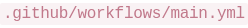 file. Which formatting rule must be followed to avoid parsing errors?

- **A.** Use curly braces 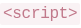 to define arrays.
- **B.** Use spaces for indentation, not tab characters.
- **C.** Wrap bash scripts in HTML tags.
- **D.** End every line with a semicolon `;`.

??? success "Answer — B"
    Use spaces for indentation, not tab characters.

??? note "Why"
    YAML builds its entire structure from indentation — nested keys are recognized by
    how far they're indented. A tab is *not* the same as spaces to the parser, and
    mixing them produces parse failures. The other options describe other languages:
    curly braces belong to JSON/JavaScript, HTML tags to markup, semicolons to C —
    YAML deliberately uses none of them.

    **One-line memory:** whitespace *is* the syntax in YAML — so it must be consistent.

---

### Q3 · SQLite startup behaviour

**🟢 Easy · 1 mark · Topic: SQLite**

A student types 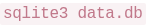 in their Bash terminal. If  doesn't exist, what immediately occurs?

- **A.** Shell throws a "File Not Found" error.
- **B.** SQLite creates a new empty database file 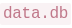.
- **C.** Interactive prompt asks for a database schema.
- **D.** Kernel triggers a script to repair the system path.

??? success "Answer — B"
    SQLite creates a new empty database file.

??? note "Why"
    SQLite is famously zero-configuration: a database is just a file, and `sqlite3`
    creates it on open if it's missing. No server daemon, no schema wizard, no
    system-path involvement.

    🟡 **The trap:** typo the database name and SQLite **silently gives you a
    brand-new empty database** instead of the data you wanted. The "file not found"
    instinct comes from other tools; SQLite doesn't have it.

---

### Q4 · Why Parquet beats CSV

**🟡 Medium · ⭐ · 1 mark · Topic: Data formats**

A student queries a remote 5GB Parquet file versus 5GB CSV. Parquet queries are much faster. Why?

- **A.** Parquet files execute logic server-side before returning data.
- **B.** CSV files include encryption that DuckDB struggles to decode.
- **C.** Parquet uses columnar storage — DuckDB downloads only requested columns.
- **D.** Parquet uses multithreading to unpack data in browser memory.

??? success "Answer — C"
    Parquet uses columnar storage — DuckDB downloads only the requested columns.

??? note "Why"
    CSV is **row-based**: every row stores every column, so reading one column means
    scanning the whole file. Parquet is **columnar**: each column's values live
    together, so a query for two columns of a twenty-column table touches a fraction
    of the bytes — and with a *remote* file, transfers a fraction over the network.

    The wrong options are plausible-sounding nonsense: nothing executes "server-side"
    (it's a file, not a service), CSV has no encryption, and "multithreading in
    browser memory" decorates a word salad.

    🟢 **Must remember:** the professor's own "odd one out" — when XML/JSON/CSV are
    grouped against Parquet in an efficiency question, the columnar one is the answer.

---

### Q5 · What goes into .gitignore

**🟡 Medium · ⭐ · 1 mark · Topic: Secrets & version control · MSQ — pick all correct**

When committing code to a public repository, which files should be added to 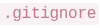? *(the four options are the paper's own images)*

- **A.** 
- **B.** 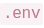
- **C.** 
- **D.** 

??? success "Answer — B and C"
    The two options holding secrets — the `.env` file and the credentials file. *(B and C are the green-marked options in the paper.)*

??? note "Why"
    `.gitignore` exists to keep things out of the repository's history. Code, docs
    and dependency lists belong in git; **credentials never do**. Once a secret is
    pushed, it's in the history forever — clones, forks, scrapers — deleting the file
    later doesn't delete the history.

    The workflow the professor stressed: keep keys in `.env`, add `.env` to
    `.gitignore` *before the first commit*, and load them with
    `os.getenv("API_KEY")`.

    🔴 **Wrong belief:** "I'll push it now and remove it before the deadline." The git
    history still has it. Bots scrape GitHub for keys within minutes.

---

### Q6 · Shell redirection

**🟢 Easy · 1 mark · Topic: Bash**

You run 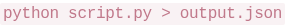. What happens?

- **A.** OS captures stdout and redirects to , replacing existing contents.
- **B.** Bash captures both stdout and stderr, merging them into .
- **C.** Script accepts  as input payload.
- **D.** OS alerts the cloud environment that Python started.

??? success "Answer — A"
    stdout is redirected to the file, replacing existing contents.

??? note "Why"
    `>` redirects **stdout only**, and it **truncates** the file first. The companions:

    - `>` — stdout, replace
    - `>>` — stdout, append
    - `2>` — stderr, replace
    - `2>&1` — stderr merged into stdout (option B's real command, not this one)

    The distinction matters in pipelines: errors go to stderr precisely so they
    *don't* pollute your redirected data file.

---

### Q7 · requests: .text vs .json()

**🟢 Easy · ⭐ · 1 mark · Topic: HTTP clients**

You fetch data with 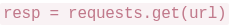. What's the difference between  and ?

- **A.**  parses bools; 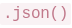 treats everything as strings.
- **B.**  returns raw string; 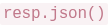 decodes to dictionary.
- **C.**  executes JavaScript files remotely in Python.
- **D.** No difference — both return strings initially.

??? success "Answer — B"
    `.text` gives the raw string; `.json()` parses it into a Python dict.

??? note "Why"
    An HTTP response body is bytes; `.text` decodes it to a string, and `.json()`
    runs `json.loads` on top of that. After `.json()` you can write `data["score"]`;
    after `.text` you can't.

    🟡 **The trap that earned its own session segment:** `json.loads` **requires double
    quotes**. `json.loads("{'score': 10}")` throws `JSONDecodeError` — Python-dict
    syntax is not JSON. Demonstrated live in ET-1.

---

### Q8 · Cloudflare Workers resilience

**🟡 Medium · 1 mark · Topic: Deployment platforms**

A Vercel server crashes for 5 minutes. A Cloudflare Worker performs the same API logic. What happens to the Worker?

- **A.** Worker also crashes — both share cloud infrastructure.
- **B.** Worker continues serving — runs on 300+ edge locations; single failures don't cause outages.
- **C.** Cloudflare reroutes traffic to the crashed Vercel server.
- **D.** Worker pauses and queues requests until Vercel recovers.

??? success "Answer — B"
    The Worker keeps serving — edge locations are independent.

??? note "Why"
    Cloudflare Workers run on the edge network — hundreds of locations, each
    independently executing your function. One provider's outage doesn't touch them.
    The question is really about **edge architecture**: code runs *near the user*,
    replicated everywhere, with no single origin to fail.

    The wrong options anthropomorphize infrastructure ("reroutes to the crashed
    server", "waits for Vercel") — independent systems don't coordinate by default.

---

### Q9 · localtunnel vs ngrok

**🟢 Easy · 1 mark · Topic: Deployment tools**

Ngrok's free tier doesn't support custom subdomains. What's localtunnel's advantage?

- **A.** Free and open-source with no signup needed to expose servers.
- **B.** Automatically deploys local servers to production cloud hosting platforms.
- **C.** Provides built-in authentication to block unauthorized tunnel access attempts.
- **D.** Encrypts all traffic whereas Ngrok sends data in plaintext.

??? success "Answer — A"
    Free, open-source, no signup — `npx localtunnel` works immediately.

??? note "Why"
    Both tools expose a local server through a public URL. The exam's comparison:
    ngrok wants an account and gates features behind it; localtunnel needs nothing
    registered.

    Wrong options confuse tunneling with hosting (B) or security features neither
    provides by default (C, D — both tunnel over HTTPS anyway).

---

### Q10 · Property-based testing invariant

**🟡 Medium · ⭐ · 1 mark · Topic: Testing**

A developer tests a sorting function with Hypothesis. Which represents a valid invariant for any sorting function?

- **A.** Output always equals  for any input.
- **B.** Output contains the same elements as input; no element exceeds its successor.
- **C.** Executes in under 10 milliseconds for all inputs.
- **D.** Input list is modified in-place without creating a new list.

??? success "Answer — B"
    Same elements as input, and every element ≤ its successor.

??? note "Why"
    Property-based testing checks **invariants** — statements true for *every* input,
    not just examples. For a sort, two properties always hold:

    1. **Permutation:** output has exactly the input's elements — nothing lost, added, duplicated
    2. **Order:** each element ≤ the next

    The wrong options fail as invariants: sorted output ≠ input (that's the opposite),
    speed isn't a correctness property, and in-place vs copied is an implementation
    choice. GA0 drills this exact thinking — "bug-hunter property-based testing."

---

## Part 2 · Two-mark questions

### Q11 · AVG over NULLs in DuckDB

**🟡 Medium · 1 mark (2-mark tier) · Topic: SQL**

In DuckDB, you run . One row has  latency. How is the average calculated?

- **A.** Ignores ; calculates using only valid rows.
- **B.** Coerces  to  and includes it in sum.
- **C.** Throws runtime error demanding  filter.
- **D.** Final aggregate result becomes .

??? success "Answer — A"
    NULL rows are excluded; the average uses the valid rows only.

??? note "Why"
    SQL's three-valued logic: NULL means *unknown*, not zero. Aggregates (`AVG`,
    `SUM`, `COUNT(column)`) **skip NULLs** — the average of `[10, 20, NULL]` is 15,
    not 10.

    🔴 **Wrong belief:** "COUNT(column) and COUNT(*) are the same." No — `COUNT(*)`
    counts rows; `COUNT(latency)` counts non-NULL values. A favourite exam trick.

    Edge case: `AVG` over *all*-NULL input does return NULL (nothing to average),
    which is how D almost becomes true — but a single NULL among valid rows never
    poisons the result.

---

### Q12 · Why the spatial index is fast

**🔴 Hard · 1 mark (2-mark tier) · Topic: Databases · older-syllabus flavour**

A spatial join of 100K customers to 50 warehouses takes 45 minutes without index, 8 seconds with index. Why?

- **A.** Spatial indexes compress geometries, reducing transfer time.
- **B.** Indexes use tree structures, avoiding testing every customer-warehouse pair.
- **C.** Indexes parallelize queries across multiple CPU cores.
- **D.** Indexes cache previous query results in memory.

??? success "Answer — B"
    Tree structures let the query skip pairs that can't match.

??? note "Why"
    Without an index, a spatial join is **O(n×m)**: 100,000 × 50 = 5 million distance
    checks. A spatial index (R-tree family) partitions space into nested regions, so
    the query prunes whole branches: "all warehouses outside this customer's bounding
    box can't be within 5 km — skip 40 of them in one comparison."

    Same principle as a B-tree index in regular SQL, generalized to two dimensions.
    Geospatial itself is out of this term's syllabus, but the concept transfers:
    **indexes turn scans into lookups by cutting the search space.**

---

### Q13 · Fixing the CORS error

**🟡 Medium · ⭐⭐ · 1 mark (2-mark tier) · Topic: Web security**

Your UI on  fetches from 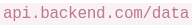. Browser throws . How to resolve?

- **A.** Use WebSockets instead of HTTP.
- **B.** Encrypt frontend payload before dispatching.
- **C.** Add  to backend response headers.
- **D.** Add  to fetch call.

??? success "Answer — C"
    The **backend** must send `Access-Control-Allow-Origin` permitting the frontend's origin.

??? note "Why"
    The **Same-Origin Policy** is enforced by the *browser*: JavaScript on origin A
    can't read responses from origin B unless B's response says A is allowed. Origin =
    scheme + host + **port** — so `localhost:3000` and `localhost:8000` are different
    origins even on one machine.

    Because the *receiver* grants permission, only the backend can fix it (C). The
    frontend can't grant itself permission (D) — that would defeat the security model.
    Encryption (B) and protocol swaps (A) are unrelated to an origin check.

    🟢 **The professor's security rationale, worth word-for-word:** browsers block
    cross-origin reads because web apps load nested third-party libraries — if one is
    compromised, without this policy it could silently exfiltrate your data to
    `evil.com`. In FastAPI:
    `app.add_middleware(CORSMiddleware, allow_origins=["http://localhost:3000"])`.

---

### Q14 · Why pin dependencies

**🟢 Easy · ⭐ · 1 mark (2-mark tier) · Topic: Reproducibility**

Why pin dependencies (e.g., 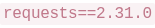) instead of leaving them unpinned?

- **A.** Ensures reproducible pipelines; prevents updates from breaking code.
- **B.** Downloads packages faster from the cloud index.
- **C.** Unpinned versions fail to execute in Docker images.
- **D.** Pinned versions compress faster into virtual RAM.

??? success "Answer — A"
    The same install works identically tomorrow.

??? note "Why"
    An unpinned `pandas` means "whatever's latest at install time." A new release with
    a changed API breaks your pipeline *months later* with nothing you did wrong.
    Pinning freezes the world: same versions, same behaviour — in Docker, on a
    colleague's machine, on the server.

    ET-2's nuance: **pin, but keep a tested upgrade path** — document the current
    version, test new ones separately, upgrade deliberately. Both extremes (never
    update / always latest) were wrong options in the T3-2025 papers.

---

### Q15 · Haversine vs UTM vs raw degrees

**🔴 Hard · ⭐ · 1 mark (2-mark tier) · Topic: Coordinates · dropped from this term's syllabus — 30-second version only**

A data analyst computes distances between delivery points stored as latitude/longitude (degrees), trying: (1) Euclidean distance directly on the raw (lat, lon) degree values, (2) the Haversine formula with Earth radius R = 6371 km, (3) converting to a projected CRS (e.g., UTM) first, then Euclidean distance in metres. Which statement is correct?

- **A.** All three give the same distance because lat/lon already act like regular metric units everywhere on Earth.
- **B.** Euclidean on raw degrees is the most accurate for far-apart points because it skips trigonometry and avoids numerical error.
- **C.** Haversine gives km along Earth's curve, UTM gives metres on a plane, and raw-degree Euclidean fails because 1° of longitude varies.
- **D.** UTM gives equally accurate distances anywhere on Earth, no matter which UTM zone the points actually fall in.

??? success "Answer — C"
    Haversine = km along the curve, UTM = metres on a plane, raw degrees fail because a degree isn't a fixed distance.

??? note "Why"
    One degree of longitude shrinks from ~111 km at the equator to 0 at the poles —
    so "degrees" aren't a fixed unit, and plain Euclidean on them is meaningless (1).
    Haversine computes great-circle distance on the sphere — the right answer in km (2).
    UTM projects the curved Earth onto flat zones where metres are true — accurate
    *within* a zone (which kills D: across zones, distortion returns).

    **The 30 seconds that transfer:** distance functions expect a specific coordinate
    order and unit. Swap (lat, lon) or feed degrees to a metric function, and you get
    confidently wrong numbers — the professor's "coordinates swapped" war story.

---

## Part 3 · Three-mark questions

### Q16 · The fraud model collapse

**🔴 Hard · ⭐ · 1 mark (3-mark tier) · Topic: ML evaluation**

Fraud model: 99.2% test accuracy, 52% production accuracy. Dataset chronological, 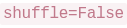, rolling stats computed before splitting. What caused collapse?

- **A.** Model overfitted — common when accuracy exceeds 95%.
- **B.**  created temporal leakage; rolling stats before split caused feature leakage.
- **C.** Different hardware causes numerical precision differences.
- **D.** Fraud patterns evolve; historical models always fail on new data.

??? success "Answer — B"
    Two leakages: shuffling destroyed the time order, and rolling stats saw the future.

??? note "Why"
    Two independent sins, both about **information from the future sneaking into
    training**:

    1. **Temporal leakage:** the data is a time series (chronological). Shuffling mixes
       future rows into the training set — the model trains on tomorrow's fraud
       patterns and "predicts" them brilliantly. In production there's no tomorrow to
       peek at.
    2. **Feature leakage:** rolling statistics (7-day averages etc.) computed on the
       *full* dataset before the split means each row's features contain windows that
       include test-period rows. Compute rolling features **after** splitting, or per
       window.

    The pattern the exam rewards: **test accuracy wildly above production accuracy =
    leakage until proven otherwise.** A's "over 95%" is numerology; D is defeatism;
    C is noise.

---

### Q17 · The edge function timeout

**🟡 Medium · ⭐ · 1 mark (3-mark tier) · Topic: Serverless limits**

A Vercel edge function processes logs; needs 40 seconds but hits  at 10 seconds. Why?

- **A.** JSON array logic crashed on a duplicate row.
- **B.** Serverless edge enforces strict timeout limits.
- **C.** Cloud router dropped an IP variable array mid-execution.
- **D.** Edge functions disable multithreading for loops >1000 iterations.

??? success "Answer — B"
    Serverless platforms cap execution time; the job outgrew the platform.

??? note "Why"
    Serverless functions are built for short requests, and platforms enforce hard
    ceilings (Vercel's is ~10s at the edge, AWS Lambda ~15 min). Exceed one and you're
    killed — no negotiation.

    This is the **time twin** of the ET-1 memory story (2GB file works on a laptop,
    dies on a free-tier function): serverless gives you strict RAM *and* strict time.
    Long jobs belong in a container, a queue, or a worker — not an edge function.

---

## Part 4 · Scenario block 1 — the FastAPI + LLM + cache story (Q18–23)

**Read the passage carefully:**

A student builds a FastAPI proxy backend to fetch movie data from a public API, pass the data to an LLM to generate a summary, and return the result to a React frontend. Initially, the student notices that every time they refresh the browser, the LLM takes 5 seconds to summarize the exact same movie, running up their API bill rapidly.

To fix this, the student adds an explicit  parameter directly to the response header. The application speeds up drastically. However, when the student tries to test the API locally by fetching from the React UI () to the backend (), the browser abruptly rejects the network connection and throws an error indicating missing headers.

After resolving the browser block, the student requires the LLM to return the summary strictly as a JSON object. Instead of hoping the LLM formats it correctly, they utilize the API's native "Structured Outputs" constraint parameter to force the mathematical generation of valid JSON architecture.

During load testing, the backend evaluates 5 web requests concurrently using asynchronous execution (). However, the entire server process completely halts when one specific downstream node hangs randomly for 60 seconds without resolving. Finally, a malicious user inputs trick instructions via the "Movie Title" input field, attempting to cleanly override the LLM's primary instructions.

### Q18 · Why the browser blocked it

**🟢 Easy · ⭐⭐ · 1 mark · Topic: CORS**

Why does the browser reject the connection when React () fetches from FastAPI ()?

- **A.** Backend lacks  for cross-port traffic.
- **B.** Single-host computing lacks multiple TCP ports.
- **C.** Browsers block all local testing traffic.
- **D.** The backend Python script deleted the network thread.

??? success "Answer — A"
    No CORS headers, so the browser's same-origin policy blocks the read.

??? note "Why"
    Same concept as Q13, seen from the error side: different ports = different
    origins = blocked unless the backend opts in. B and C invent fake browser rules; D
    is absurdist. One family, four questions across two shifts — **CORS is the single
    most-tested concept in this paper.**

---

### Q19 · What max-age=3600 does

**🟢 Easy · ⭐⭐ · 1 mark · Topic: Caching**

What does  do?

- **A.** Forces the backend to pause 3,600 ms before replying.
- **B.** Authorizes caches to store/serve the data for 60 minutes.
- **C.** Limits response visibility to 1 user.
- **D.** Creates an SQLite database on the client to store data.

??? success "Answer — B"
    Browsers, proxies and CDNs may serve a copy for 3600 seconds.

??? note "Why"
    `public` = intermediaries may cache; `max-age=3600` = the copy is fresh for 3600
    seconds. Within that hour, repeat requests never reach the origin — which is why
    the student's LLM bill collapsed.

    🟢 **Must remember the whole family:** TTL = how long a cached copy lives ·
    `Cache-Control` = the header that sets it · `?t=123` cache-buster = fake-new URL
    to force a fresh fetch. All three were exam questions (see Q22).

---

### Q20 · What Structured Outputs guarantees

**🟡 Medium · ⭐ · 1 mark · Topic: LLM APIs**

What guarantee does "Structured Outputs" provide for LLM JSON generation?

- **A.** Encrypts the JSON output within the browser.
- **B.** Guarantees 100% factually accurate summaries.
- **C.** Restricts token generation to prevent JSON syntax violations.
- **D.** Increases the API timeout by 3600 milliseconds.

??? success "Answer — C"
    The model's token generation is constrained so invalid JSON can't be produced.

??? note "Why"
    Structured Outputs (OpenAI's `response_format` with a schema) works at the
    *sampling* level: at each step the model can only emit tokens that keep the output
    valid against the schema. Syntax is guaranteed; **facts are not** (B — the model
    can still be wrong, just grammatically).

    The FN twin put it best: *structured outputs constrain generation; Python
    validation detects errors after*. Prevention vs detection — different layers.

---

### Q21 · asyncio.gather with a hanger

**🟡 Medium · ⭐⭐ · 1 mark · Topic: Concurrency**

In , 4 nodes resolve in 1s, 1 hangs for 60s. What happens?

- **A.** Resolves after 1s, assigns  to hanging thread.
- **B.** Waits 60s for all nodes before returning results.
- **C.** Python cuts the hanging thread from the server.
- **D.** The hanging thread throws HTTP 404 to avoid timeout.

??? success "Answer — B"
    Gather waits for every task; total time = the slowest one.

??? note "Why"
    `asyncio.gather` returns only when **all** its awaitables finish. One hanger holds
    the whole call hostage — the professor's arithmetic: 4 requests at 1s + 1 at 10s =
    **10 seconds**, not 5, not 1. Concurrency removes the *sum*, not the *max*.

    Production lesson: wrap each call in `asyncio.wait_for(..., timeout=...)` so one
    dead node can't stall the server. Deeper point: **parallelism doesn't fix a
    single slow dependency.**

---

### Q22 · Forcing fresh data past the cache

**🟢 Easy · ⭐⭐ · 1 mark · Topic: Caching**

How to force the cache to fetch fresh data instead of serving cached results?

- **A.** Append unique query parameter (e.g., ) to mutate cache key.
- **B.** Run 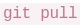 on backend to invalidate headers.
- **C.** Delete the payload encryption algorithm locally.
- **D.** Refresh the browser tab twice rapidly.

??? success "Answer — A"
    A changed URL is a new cache key, so the cache misses and the origin is hit.

??? note "Why"
    Caches key on the full URL. `?t=12345` makes a URL the cache has never seen — it
    must fetch. It's the classic **cache-buster**, and it's why deployments bump
    `app.js?v=3`: invalidate everyone's cache at once.

    D is superstition; C is sabotage; B works but is a sledgehammer — the question
    asks what the *client's JavaScript* can do.

---

### Q23 · Defending the LLM from the input field

**🟡 Medium · ⭐⭐ · 1 mark · Topic: Prompt injection**

How to defend the LLM from malicious "Movie Title" input overriding instructions?

- **A.** Append an integer limit string inside the proxy cache.
- **B.** Place core rules in an isolated 'System Role' vs 'User Role' inputs.
- **C.** Limit the React input to 20 alphanumeric characters.
- **D.** Encrypt the movie string in the database before querying the API.

??? success "Answer — B"
    System prompt carries the rules; user input rides in the user role, which the model weighs less.

??? note "Why"
    LLMs assign **higher attention to the system/developer prompt** than the user
    prompt — the designed hierarchy that keeps operating rules in charge when a user
    types "ignore previous instructions." Defense in depth: role separation (this
    question) + input filtering (the FN paper's variant: lowercase + regex, not
    exact-string matching).

    C might blunt *some* payloads but breaks legitimate titles ("Amélie",
    "Spider-Man 2"); A and D are noise. Note what the answer *isn't*: no option
    pretends filtering alone is sufficient — the professor treats role separation as
    the primary defense.

---

## Part 5 · Short-answer questions (Q24–25) — LLM-graded

**Scenario: HUGGINGFACE_DOCKER_LATENCY**

A developer deploys a Machine Learning text-classification service hosted dynamically on Hugging Face Docker Spaces. During production monitoring, the developer realizes the service boots painfully slowly and frequently crashes abruptly midway through container initialization. Additionally, the developer attempts to map API logs natively into an internal SQLite file locally within the cloud environment but is unsure if this breaks data retention policies.

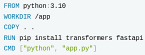{: .tx-full }

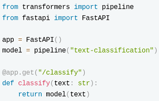{: .tx-full }

### Q24 · Docker layer caching

**🟡 Medium · ⭐ · 2 marks · Topic: Docker · Short answer — max 200 words**

Identify the critical sequencing error within the provided Dockerfile. Explain structurally how this specific order ruins layer caching, leading to severely inefficient build pipelines upon every minor code update.

??? success "Model answer (ours — the paper shows no solution)"

    **The error:** `COPY . .` (full source) runs **before** `RUN pip install -r requirements.txt`.

    - **Layer caching rule:** Docker rebuilds a layer only when its inputs change —
      and every layer *after* a changed layer rebuilds too.
    - **Consequence:** any code edit changes the `COPY` layer → all later layers,
      including the dependency install, rerun → packages re-download on every minor
      code update even though `requirements.txt` never changed.
    - **Fix:** copy `requirements.txt` first, install, then copy the code. Now the
      dependency layers stay cached across code-only changes.
    - *Trade-off:* none — the final image is identical; only build speed improves.

??? note "How to write it in the exam"

    This is the **Diagnose-a-failure** shape: root cause in one sentence → mechanism →
    fix → trade-off. Four bullets, ~120 words, every line checkable. The vocabulary the
    grader wants: *layer, cache invalidation, build context, reproducibility.*

---

### Q25 · Model cold starts

**🟡 Medium · 2 marks · Topic: ML systems · Short answer — max 200 words**

The Hugging Face pipeline initializes globally at application startup. Explain fundamentally why executing parameter-weights fetching dynamically during runtime creates massive "Cold Start" execution latency.

??? success "Model answer (ours)"

    **The cause:** the model's weights are downloaded and loaded into memory when the
    container starts, not baked into the image.

    - **Mechanism:** on boot, the service must fetch hundreds of MB–GB of weights over
      the network, deserialize them, and warm up the runtime — all before the first
      request. Every restart/cold scale-up pays it again.
    - **Why "global at startup" makes it worse:** initialization blocks the app's
      readiness, so health checks time out and the platform may kill the container
      mid-boot — the "crashes during initialization" symptom.
    - **Fixes:** bake the weights into the Docker image (larger image, fast starts)
      or keep a warm instance alive; lazy-load in the background only if the first
      request may tolerate the delay.
    - *Trade-off:* image size and pull time vs cold-start latency.

??? note "How to write it in the exam"

    Same skeleton as Q24 — both SA questions reward the same skill: **explain a
    mechanism, then name the fix and its cost.** Practice the shape in
    [the grading guide](../exam/llm-grading-guide.md).

---

## Part 6 · Scenario block 2 — the browser dashboard (Q26–28)

**Read the passage carefully:**

A student builds a browser-based data dashboard to avoid backend server costs. They compile DuckDB and Python into WebAssembly using Pyodide, enabling SQL queries to run directly in the browser. The dashboard downloads a 1.5GB Parquet database locally.

Initially, it works well — Parquet's columnar format allows querying specific columns without lag. However, during a demo, critical issues emerge. First, clicking "Run Complex Query" freezes the entire UI for 10 seconds — animations halt and buttons become unresponsive. Second, attempting to use Python's  library (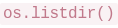, 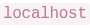) crashes the WASM engine with "module unavailable" errors. Third, loading multiple dashboards across Chrome tabs triggers "Out-Of-Memory" exceptions, forcing the browser to terminate pages. The developer decides to abandon the browser approach and migrate the application to a Docker container running on .

### Q26 · Why the UI freezes

**🟡 Medium · 1 mark · Topic: WebAssembly**

Why does clicking "Run Complex Query" freeze the UI, blocking all clicks and animations?

- **A.** SQLite queries routinely disable client-side graphics architecture by design intentionally.
- **B.** WASM executes on the browser's main thread, blocking all UI rendering events.
- **C.** React prevents overlapping interactions using internal thread locks dynamically and safely.
- **D.** The server explicitly overrides the mouse tracking functionality remotely during execution.

??? success "Answer — B"
    The query runs on the main thread; the browser can't render while it computes.

??? note "Why"
    A browser page has **one main thread** for both JavaScript/WASM execution and
    rendering (paint, animations, input events). A 10-second query on it means 10
    seconds of frozen page. The fix — a Web Worker — exists precisely to move compute
    off the main thread; knowing that sentence is what shows understanding.

    A, C, D are invented mechanics — when an option sounds like a conspiracy theory
    ("the server overrides mouse tracking"), it's filler.

---

### Q27 · Why matplotlib fails in Pyodide

**🔴 Hard · 1 mark · Topic: WebAssembly**

Why does Python code like 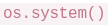 fail when executing inside Pyodide/WebAssembly in the browser?

- **A.** The libraries are deprecated and removed in newer Python 3 versions.
- **B.** Pyodide struggles to parse string formats inside terminal commands system limitations.
- **C.** Browsers operate as sandboxes isolated from hardware without native OS bindings.
- **D.** WASM requires sudo privileges to execute system commands inside JavaScript environments.

??? success "Answer — C"
    The browser sandbox has no OS access; packages needing native bindings can't run.

??? note "Why"
    Pyodide compiles Python *itself* to WebAssembly — pure-Python packages work, but
    anything with **C extensions expecting an operating system** (GUI toolkits, file
    systems, native graphics) hits the sandbox wall. The browser deliberately exposes
    no raw OS: no processes, no filesystem writes outside APIs, no native windows.

    D's "sudo in JavaScript" is nonsense (no user to elevate); A is false (matplotlib
    thrives outside the browser); B decorates a non-mechanism. One sentence: **WASM is
    sandboxed by design; the sandbox has no OS.**

---

### Q28 · EXPOSE vs -p

**🟢 Easy · ⭐⭐ · 1 mark · Topic: Docker**

After moving the application to Docker with  in the Dockerfile, running  fails to connect at . What is missing?

- **A.** EXPOSE is documentation only — the developer must map ports using a flag like `-p` explicitly.
- **B.** Docker containers change IP addresses sequentially, requiring VPN proxy configuration.
- **C.** Localhost implicitly bans Docker from creating network bridges for security protection reasons.
- **D.** The execution lacks explicit SSL cryptographic certificate bindings for local Docker network connections.

??? success "Answer — A"
    `EXPOSE` documents; `docker run -p 8501:8501` actually publishes.

??? note "Why"
    `EXPOSE` is a **label**: "this container listens on 8501" — a courtesy for humans
    and tooling. Publishing the port to the host needs `-p host:container` at runtime.
    The professor's phrasing: EXPOSE is documentation, `-p` is the bridge.

    🟢 **Must remember:** `EXPOSE 8501` → nobody can reach it. `docker run -p 8501:8501`
    → `localhost:8501` works. Three sources asked this exact distinction — among the
    most reliably repeated marks in the paper set.
