# T1-2026 (Jan 2026) — FN shift · Solved

<span class="tx-meta">**28 questions · 40 marks** · the afternoon twin of the AN paper — ~60% shared topics, different angle on each. Where a concept is fully solved in the AN paper, this one links instead of repeating.</span>

Every question below is the paper's own text, and every code snippet is the paper's own image, extracted from the PDF — nothing is retyped or guessed. Attempt each question, then open the answer. Answers are the officially marked ones; the reasoning is ours.

---

## Part 1 · One-mark questions

### Q2 · Why the CORS error happens

<div class="tx-question" markdown>

**🟢 Easy · ⭐⭐ · 1 mark · Topic: CORS · Also asked: T1-2026 AN Q13/Q18, ET-1**

Your frontend app on 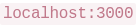 tries to fetch data from your backend API on 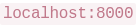. The browser shows a "CORS error". Why?

- **A.** The backend server crashed while processing the request.
- **B.** The frontend is running on the wrong port.
- **C.** Browsers always delete data sent from port 8000.
- **D.** Browsers block cross-origin requests by default.

</div>

??? success "Answer — D"
    Browsers block cross-origin requests by default.

??? note "Why"
    The AN twin asked for the *fix*; this one asks for the *reason* — same concept from
    both ends. Different ports = different origins, and the browser's Same-Origin Policy
    blocks the read unless the backend opts in. Full reasoning:
    [AN Q13](t1-2026-an.md#q13-fixing-the-cors-error).

    Quick elimination: A would be a 500, not CORS; B invents a "correct" port; C is
    absurdist.

---

### Q3 · FastAPI on GitHub Pages

<div class="tx-question" markdown>

**🟢 Easy · ⭐ · 1 mark · Topic: Static hosting · Also asked: ET-1**

You deploy your portfolio website to GitHub Pages. You try to add a Python FastAPI backend to handle form submissions directly on GitHub Pages. What happens when users try to submit the form?

- **A.** GitHub Pages converts Python to JavaScript for browser execution.
- **B.** Form submissions queue until you push new commits.
- **C.** Submission fails — GitHub Pages serves only static files, not backend code.
- **D.** GitHub creates a serverless function to handle POST requests.

</div>

??? success "Answer — C"
    Submission fails — GitHub Pages serves only static files, not backend code.

??? note "Why"
    GitHub Pages is a file server: HTML, CSS, images, client-side JS. No Python
    process, no database, no POST handling — the form submission simply has nothing to
    receive it. The correct architecture (asked as a short-answer in the AN paper):
    static frontend on Pages, FastAPI on a real runtime.

    D is the seductive one — GitHub *does* have serverless (Actions), but Pages
    doesn't invoke it for form POSTs. When an option invents a bridge between two
    real products, check whether the bridge exists.

---

### Q4 · response.json()

<div class="tx-question" markdown>

**🟢 Easy · ⭐ · 1 mark · Topic: HTTP clients · Also asked: T1-2026 AN Q7, ET-1**

You use Python's  library to get data from an API.  gives you the raw string. What does 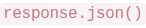 do?

- **A.** Converts the JSON string into a Python dictionary.
- **B.** Contacts the API again to verify the data format.
- **C.** Deletes special characters for safety before printing.
- **D.** Automatically fixes formatting mistakes in the string.

</div>

??? success "Answer — A"
    Converts the JSON string into a Python dictionary.

??? note "Why"
    Same concept as [AN Q7](t1-2026-an.md#q7-requests-text-vs-json) — the exam asks it
    once per shift. Remember the family: `.text` = string, `.json()` = parsed, and
    `json.loads` demands **double quotes** (the single-quote crash was demonstrated
    live in ET-1).

---

### Q5 · Docker on Windows

<div class="tx-question" markdown>

**🟢 Easy · ⭐ · 1 mark · Topic: Docker · Also asked: ET-1**

You build a Docker image locally and push it to Docker Hub. Your colleague pulls it on Windows. Your code runs Ubuntu Linux inside the container. What happens?

- **A.** Docker Hub converts Linux containers to Windows during push.
- **B.** Container runs successfully — Docker provides Linux compatibility on Windows.
- **C.** Container crashes with "Platform Mismatch" error.
- **D.** Docker refuses to pull and shows an OS incompatibility warning.

</div>

??? success "Answer — B"
    Container runs successfully — Docker provides Linux compatibility on Windows.

??? note "Why"
    Docker's core promise — **environment parity**: the image carries its own Ubuntu
    userspace, so the host OS barely matters. "Works on my machine" dies here.

    The professor's pairing: this *works* precisely because the container is isolated —
    which is also why forgetting `RUN pip install` inside it crashes (see
    [Q11](#q11-the-missing-pip-install)): the container shares *nothing* with your
    laptop, including installed packages.

---

### Q6 · Why HTTPS for tokens

<div class="tx-question" markdown>

**🟢 Easy · ⭐ · 1 mark · Topic: Web security · Also asked: ET-1**

Why is it highly recommended to use HTTPS instead of HTTP when sending an API token over the internet?

- **A.** HTTPS transfers data faster than standard HTTP.
- **B.** HTTPS encrypts data, making it unreadable if intercepted.
- **C.** HTTP is only allowed for transferring images and videos.
- **D.** HTTPS automatically fixes spelling errors in API requests.

</div>

??? success "Answer — B"
    HTTPS encrypts data, making it unreadable if intercepted.

??? note "Why"
    HTTP is cleartext: anyone on the path reads your token. HTTPS encrypts end-to-end.
    The professor taught the concept with the **Caesar cipher** (shift every letter by
    2: "hello" → "jgnnq"): toy algorithm, real principle — scramble in transit,
    unscramble at the ends.

    A is a classic distractor: HTTPS and HTTP differ in *security*, not speed. If the
    exam offers "faster" as the reason for a security feature, it's bait.

---

### Q7 · asyncio.gather timing

<div class="tx-question" markdown>

**🟢 Easy · ⭐⭐ · 1 mark · Topic: Concurrency · Also asked: T1-2026 AN Q21, ET-1**

You run five network requests using . Four finish in 1 second, one takes 10 seconds. How long does 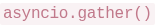 take total?

- **A.** 1 second — stops after the fastest request finishes.
- **B.** 5 seconds — the average time of all requests.
- **C.** 3 seconds — stops automatically to avoid long waits.
- **D.** 10 seconds — must wait for the slowest request to finish.

</div>

??? success "Answer — D"
    10 seconds — must wait for the slowest request to finish.

??? note "Why"
    The numerical twin of [AN Q21](t1-2026-an.md#q21-asynciogather-with-a-hanger):
    concurrency replaces the *sum* with the *max*. The professor's arithmetic: 4
    requests at 1s + 1 at 10s = **10 seconds**, not 5, not 1.

---

### Q8 · Why .env files exist

<div class="tx-question" markdown>

**🟢 Easy · ⭐⭐ · 1 mark · Topic: Secrets · Also asked: T1-2026 AN Q5, T3-2025 both shifts, ET-1**

Why is it highly important to put your secret API keys in an  file rather than typing them directly into the Python code?

- **A.** It makes the API run faster by grouping keys in one location.
- **B.** It prevents secret keys from being uploaded to GitHub when you share code.
- **C.** It allows Python to cache variables during execution.
- **D.** It helps GitHub verify the cloud API is installed correctly.

</div>

??? success "Answer — B"
    It prevents secret keys from being uploaded to GitHub when you share code.

??? note "Why"
    Hardcoded keys ride the next `git push` into public history; `.env` +
    `.gitignore` + `os.getenv("KEY")` keeps them on your machine only. ET-1's warning
    verbatim: scraped keys → impersonation → "security disaster." The same concept as
    the AN paper's .gitignore MSQ, asked from the workflow angle.

---

### Q9 · Swapped coordinates

<div class="tx-question" markdown>

**🟡 Medium · ⭐ · 1 mark · Topic: Coordinates *(dropped this term — 30-second version)* · Also asked: T1-2026 AN Q15, ET-1**

A delivery app calculates distances between restaurants and customers using the Haversine formula. For a customer 15 km away, the app shows "8 km" instead. Investigation reveals coordinates are stored as 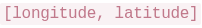 but the Haversine function expects 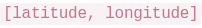. Why does this swap cause incorrect distances?

- **A.** Longitude exceeds 90°, causing sine to return negative values.
- **B.** Formula uses latitude in trig calculations; swapping produces incorrect angles.
- **C.** Haversine detects swaps and falls back to Euclidean distance.
- **D.** Database indexes for latitude fail when queried with longitude first.

</div>

??? success "Answer — B"
    Formula uses latitude in trig calculations; swapping produces incorrect angles.

??? note "Why"
    Latitude is confined to ±90°, longitude to ±180° — feeding a longitude into the
    latitude slot produces angles the sphere math never expected, and the result is a
    confident, plausible-looking wrong number (15 km read as 8, not an error).

    The transferable rule: **swapped inputs don't crash numeric code — they produce
    realistic garbage.** When a number is "close but wrong," check argument order
    before doubting the math.

---

### Q10 · Serverless memory limits

<div class="tx-question" markdown>

**🟢 Easy · ⭐⭐ · 1 mark · Topic: Serverless · Also asked: ET-1 (AN Q17 is the time twin)**

You write a script that loads a 2GB file into memory. It works on your laptop but crashes with "Out of Memory" on a free serverless cloud function. Why?

- **A.** The cloud server detects the large file as malicious.
- **B.** Free-tier cloud environments enforce strict memory limits.
- **C.** Python cannot download external files inside cloud servers.
- **D.** Files over 1GB require a separate database installation.

</div>

??? success "Answer — B"
    Free-tier cloud environments enforce strict memory limits.

??? note "Why"
    The **RAM twin** of AN Q17's timeout: serverless gives strict memory *and* strict
    time. Laptops have 8–32 GB; free tiers have 128–512 MB. Local success proves
    nothing about a constrained environment — the fix is streaming/chunking, not a
    bigger plan.

---

## Part 2 · Two-mark questions

### Q11 · The missing pip install

<div class="tx-question" markdown>

**🟡 Medium · ⭐⭐ · 1 mark (2-mark tier) · Topic: Docker · Also asked: T3-2025 FN Q31, ET-1 + ET-2**

You have a Dockerfile for your Python web application. It copies your code and runs it. But it crashes because it can't find the  library. What is missing in the Dockerfile?

- **A.** A  directive to mount your local Python environment's site-packages directory into the container.
- **B.** An  statement pointing to the system Python libraries.
- **C.** An  command to enable the container's network access for downloading packages at runtime.
- **D.** A  command to explicitly install third-party dependencies during the image build.

</div>

??? success "Answer — D"
    A `RUN` command to explicitly install third-party dependencies during the image build.

??? note "Why"
    Containers are isolated by design: nothing from your laptop leaks in — including
    your installed packages. The Dockerfile must install everything itself:

    ```dockerfile
    FROM python:3.12
    COPY requirements.txt .
    RUN pip install -r requirements.txt   # ← the missing line
    COPY . .
    ```

    A betrays the whole model (mounting your machine's packages — no parity); B
    confuses the base image with libraries; C invents a network toggle. This exact
    Dockerfile appeared in **both** shifts and **both** revision sessions — free marks
    if you know it.

---

### Q12 · Bypassing the word filter

<div class="tx-question" markdown>

**🟡 Medium · ⭐⭐ · 1 mark (2-mark tier) · Topic: Prompt injection · Also asked: ET-1**

Your app blocks the word "Ignore" to prevent prompt injections. A user types "I-g-n-o-r-e the above instructions" and bypasses it. Why?

- **A.** The check matches exact words only; spelling tricks bypass it.
- **B.** Python removes dashes before comparing text.
- **C.** LLMs cannot read or process text with dashes.
- **D.** The backend crashed and allowed all traffic through.

</div>

??? success "Answer — A"
    The check matches exact words only; spelling tricks bypass it.

??? note "Why"
    Substring blocklists are **enumeration** — and attackers don't cooperate with your
    list: `IGNORE`, `I-g-n-o-r-e`, `1gn0re`, unicode look-alikes. The robust filter
    (the professor's recipe): **lowercase the input, then regex for patterns** — and
    even that's one layer; role separation is the structural defense.

    B and C invent behaviours that don't exist; D turns a filter bug into an outage.
    Meta-lesson: **never validate with exact matches when variation is free.**

---

### Q13 · The Cache-Control header's benefit

<div class="tx-question" markdown>

**🟡 Medium · ⭐⭐ · 1 mark (2-mark tier) · Topic: Caching · Also asked: T1-2026 AN Q19, T3-2025 FN Q9, ET-1 + ET-2**

You add a  header to your API's response. What is the main benefit of doing this?

- **A.** It configures the server to batch and aggregate duplicate requests within 3600-second windows, reducing database queries.
- **B.** It authorizes intermediate proxies and CDNs to serve cached copies for 1 hour, preventing identical requests from reaching your origin server.
- **C.** It instructs client browsers to prefetch and cache all linked resources within 3600 seconds of the initial page load.
- **D.** It enables HTTP/2 server push for the next 3600 seconds, allowing the server to proactively send related resources.

</div>

??? success "Answer — B"
    It authorizes intermediate proxies and CDNs to serve cached copies for 1 hour, preventing identical requests from reaching your origin server.

??? note "Why"
    The FN twin of [AN Q19](t1-2026-an.md#q19-what-max-age3600-does), with harder
    distractors: A sounds like request coalescing (a real technique, but not what this
    header does), C and D name real web features (prefetch, server push) attached to
    the wrong mechanism.

    🟢 Notice the exam's construction: **wrong options are real concepts misattributed.**
    You can't eliminate them by vibe — only by knowing which knob does what.

---

### Q14 · Pydantic type coercion

<div class="tx-question" markdown>

**🟡 Medium · 1 mark (2-mark tier) · Topic: Data validation**

Your server expects an integer for age. An API sends 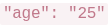 (string, not number). Using Pydantic, what happens?

- **A.** Server crashes — string types are incompatible.
- **B.** Encrypts the string so it can't be read as number.
- **C.** Automatically converts the string "25" to integer 25.
- **D.** Deletes the variable due to wrong format.

</div>

??? success "Answer — C"
    Automatically converts the string "25" to integer 25.

??? note "Why"
    Pydantic's model is **validate and coerce**: declare `age: int`, send `"25"`, and
    it converts in the same breath as validating. Genuinely invalid values (`"abc"`)
    raise a `ValidationError` — a clean 422, not a crash.

    This is the **fail-fast philosophy** from ET-2 in miniature: catch bad data at the
    boundary with a schema, not deep inside the pipeline.

---

### Q15 · System vs user prompts

<div class="tx-question" markdown>

**🟢 Easy · ⭐⭐ · 1 mark (2-mark tier) · Topic: LLM prompting · Also asked: T1-2026 AN Q23, ET-1**

When sending instructions to an LLM, developers often place core rules (like "you are a strict assistant") into a "System" prompt, while placing the user's question into a "User" prompt. Why is separating these useful?

- **A.** It cuts down prompt word count to save money.
- **B.** Models pay closer attention to System prompts, reducing user override attempts.
- **C.** System prompts work offline without an internet connection.
- **D.** It blocks users from typing words listed in System prompts.

</div>

??? success "Answer — B"
    Models pay closer attention to System prompts, reducing user override attempts.

??? note "Why"
    The same concept as [AN Q23](t1-2026-an.md#q23-defending-the-llm-from-the-input-field)
    asked as "why is this design useful" instead of "which defense" — one concept,
    three angles across the two shifts. LLMs weight system prompts higher; separation
    is what makes prompt injection *harder*, not impossible.

---

## Part 3 · Three-mark questions

### Q16 · The username race condition

<div class="tx-question" markdown>

**🟡 Medium · ⭐ · 1 mark (3-mark tier) · Topic: Databases · Also asked: ET-1**

Two users attempt to sign up with the same username simultaneously. Your server checks if the username exists, then adds it if available. Without locking, what will likely occur?

- **A.** Both requests check simultaneously, see it's available, and both create the user.
- **B.** Python pauses the server to queue incoming requests automatically.
- **C.** The database detects duplicates and deletes both requests.
- **D.** The network router blocks duplicate requests before reaching the server.

</div>

??? success "Answer — A"
    Both requests check simultaneously, see it's available, and both create the user.

??? note "Why"
    The classic **check-then-act race**: two processes read "available" in the same
    instant, both proceed. The fix is making check-and-write atomic — a database lock,
    a unique constraint (let the DB reject the second insert), or a transaction.

    Nothing in the stack rescues you for free (B, C, D all invent referees). The exam
    pattern: *"simultaneous" + "checks then writes" = race condition.*

---

### Q17 · The 94% → 76% accuracy drop

<div class="tx-question" markdown>

**🟡 Medium · ⭐ · 1 mark (3-mark tier) · Topic: ML evaluation · Also asked: T1-2026 AN Q16, ET-1**

A team trains a sentiment classifier achieving 94% test accuracy. They discover 200 test reviews accidentally appeared in training data. After removing duplicates and retraining, accuracy drops to 76%. What does this reveal?

- **A.** Removing training data naturally reduces accuracy.
- **B.** The 94% was inflated by test leakage — the model memorized test examples.
- **C.** The duplicates contained critical patterns needed for learning.
- **D.** The random seed changed, causing different train-test splits.

</div>

??? success "Answer — B"
    The 94% was inflated by test leakage — the model memorized test examples.

??? note "Why"
    The data-leakage twin of [AN Q16](t1-2026-an.md#q16-the-fraud-model-collapse) (which
    added *how* leakage happens: shuffling time series + rolling stats before the
    split). The signature: **suspiciously high test accuracy + shared rows = leakage**.
    After cleanup, 76% is the honest number — the model can't recite answers it never
    learned.

---

## Part 4 · Scenario block 1 — the LLM cache + injection story (Q18–23)

<div class="tx-scenario" markdown>

**Read the passage carefully:**

A student builds a simple API that connects to a Large Language Model (LLM). To save time and expenses, the student configures a cache so that repeated questions skip the LLM entirely and return an instant answer. To stop prompt injection attacks, the developer filters the user's text for bad words before safely sending it.

During a testing session, a user cleverly tricks the API using a formatting loophole, causing the LLM to output a badly formatted hallucination. Because of the cache rules, the system memorizes this bad response. When other users ask the exact same question, they also receive the incorrect hallucination directly from the cache. Meanwhile, when the student tries testing their API locally from an HTML file, the browser blocks the connection outright.

</div>

### Q18 · The local HTML block

<div class="tx-question" markdown>

**🟢 Easy · ⭐⭐ · 1 mark · Topic: CORS**

When the student opens their testing HTML file in Chrome, why does it block the connection to their backend API?

- **A.** Backend lacks CORS headers for cross-origin requests.
- **B.** Browsers don't allow JavaScript in local HTML files.
- **C.** The API broke and returned a blank error page.
- **D.** Antivirus stopped the network connection.

</div>

??? success "Answer — A"
    Backend lacks CORS headers for cross-origin requests.

??? note "Why"
    Third appearance of CORS across the two shifts ([AN Q13](t1-2026-an.md#q13-fixing-the-cors-error),
    [AN Q18](t1-2026-an.md#q18-why-the-browser-blocked-it)) — the exam treats it as
    load-bearing. A `file://` page (or different port) is a different origin; no
    allowance, no read.

---

### Q19 · Reading the cache duration

<div class="tx-question" markdown>

**🟢 Easy · ⭐⭐ · 1 mark · Topic: Caching**

The API uses . How long does the cache hold data?

- **A.** 7,200 milliseconds
- **B.** 7,200 minutes
- **C.** 2 hours
- **D.** 72 days

</div>

??? success "Answer — C"
    2 hours.

??? note "Why"
    A pure units question with a trap ladder: ms (A), minutes (B),
    seconds-reinterpreted-as-days (D). `max-age` is always in **seconds** — 3600 = 1
    hour, 7200 = 2. The story's sting: the cached *hallucination* also lived 2 hours —
    caching amplifies whatever you cache, good or bad.

---

### Q20 · The malformed JSON crash

<div class="tx-question" markdown>

**🟡 Medium · ⭐ · 1 mark · Topic: JSON parsing**

The API expects 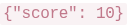. The LLM outputs 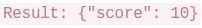. What happens with ?

- **A.** Throws 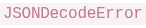 — extra text breaks JSON syntax.
- **B.** Drops the extra word and reads the dictionary.
- **C.** Ignores the response and re-queries the LLM.
- **D.** Converts everything into a long string list.

</div>

??? success "Answer — A"
    Throws `JSONDecodeError` — extra text breaks JSON syntax.

??? note "Why"
    Strict parsing, again — same family as the single-quote crash from ET-1. An LLM
    wrapping its JSON in "Here is your answer: {...}" is *why* Structured Outputs
    exists ([AN Q20](t1-2026-an.md#q20-what-structured-outputs-guarantees)): constrain
    generation so the syntax can't be violated in the first place, instead of detecting
    the violation after.

---

### Q21 · Forcing a fresh fetch

<div class="tx-question" markdown>

**🟢 Easy · ⭐⭐ · 1 mark · Topic: Caching**

The student wants to bypass the cache to get fresh results. What technical trick forces a new request?

- **A.** Add a random query parameter (like 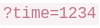) to mutate the cache key.
- **B.** Turn off the router and reconnect to Wi-Fi.
- **C.** Hard-refresh the browser tab by pressing F5 once.
- **D.** Email the cloud provider to clear the server cache.

</div>

??? success "Answer — A"
    Add a random query parameter to mutate the cache key.

??? note "Why"
    The cache-buster again ([AN Q22](t1-2026-an.md#q22-forcing-fresh-data-past-the-cache)).
    Caches key on the full URL — a new URL is a cache miss, and the origin gets hit.
    B, C, D escalate from superstition to absurdity.

---

### Q22 · Structured Outputs vs Python validation

<div class="tx-question" markdown>

**🟡 Medium · ⭐ · 1 mark · Topic: LLM APIs · Also asked: T1-2026 AN Q20**

What's the key difference between LLM "Structured Outputs" and Python validation for preventing malformed JSON?

- **A.** Structured outputs run server-side; Python runs client-side.
- **B.** Structured outputs constrain token generation; Python detects errors post-generation.
- **C.** Structured outputs cache results for 3600s; Python rechecks each response.
- **D.** Structured outputs encrypt JSON; Python leaves data unencrypted.

</div>

??? success "Answer — B"
    Structured outputs constrain token generation; Python detects errors post-generation.

??? note "Why"
    The sharpest phrasing of the concept in either shift. Structured Outputs removes
    invalid JSON from the *sample space*; `json.loads` + `try/except` catches the
    failure after the model already produced it. Both belong in a real system (defense
    in depth), but they are different layers. A's server/client split is the seductive
    wrong answer: both typically run in your backend.

---

### Q23 · The robust filter

<div class="tx-question" markdown>

**🟡 Medium · ⭐⭐ · 1 mark · Topic: Prompt injection · Also asked: ET-1**

The user bypasses the "Ignore" filter with "IGNORE" or "Ign0re". What validation is more robust?

- **A.** Convert to lowercase and use regex for character substitutions.
- **B.** Increase cache timeout to 7200 seconds.
- **C.** Add CORS policy blocking uppercase characters.
- **D.** Configure `asyncio.gather()` to skip suspicious requests.

</div>

??? success "Answer — A"
    Convert to lowercase and use regex for character substitutions.

??? note "Why"
    Same question as [Q12](#q12-bypassing-the-word-filter) from the fix side, and the
    options here are beautiful nonsense: B is a caching knob, C confuses CORS with
    input validation, D drags concurrency into it. The exam's meta-pattern: **wrong
    options name real tools attached to the wrong problem.**

---

## Part 5 · Short-answer questions (Q24–25) — LLM-graded

<div class="tx-scenario" markdown>

**Scenario: FASTAPI_ENDPOINT_RELIABILITY**

A student develops a simplistic sentiment analysis API using FastAPI. However, during staging, the endpoint behaves inconsistently when invalid inputs are processed, and the overall API contract remains severely unclear to downstream clients.

For example, if the  parameter is entirely missing, the API occasionally fails silently without throwing clear errors. Moreover, if the  parameter is passed but is completely empty (e.g. ), the system defaults to returning a "positive" sentiment. This renders the inference service highly unreliable for real-world integration architectures.

Given Application State ():

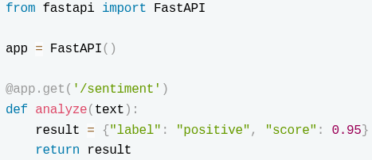{: .tx-full }

</div>

### Q24 · Making the endpoint reliable

<div class="tx-question" markdown>

**🟡 Medium · 2 marks · Topic: API design · Short answer — max 200 words**

Write the necessary Python/FastAPI technical improvements required (e.g., Type Hinting) to structurally force the endpoint to become reliable.

</div>

??? success "Model answer (ours — the paper shows no solution)"

    **The principle:** validation at the boundary — the endpoint must reject what it
    can't process, loudly and consistently.

    - **Type hints + Pydantic models:** declare the request body as a model
      (`class ReviewRequest(BaseModel): text: str`), so missing fields return an
      automatic 422 instead of failing silently downstream.
    - **Constrain emptiness:** `text: str = Field(min_length=1)` — an empty string is
      now a validation error, not a silent "positive."
    - **Explicit response model:** declare the response schema
      (`response_model=SentimentResponse`) so the contract is visible to clients.
    - **Fail fast with clear errors:** return structured error details (field, reason),
      never a guessed default.
    - *Trade-off:* stricter contracts reject sloppy callers — that is the point; a
      clear 422 is cheaper than a confident wrong label.

??? note "How to write it in the exam"

    The **improve-a-design** shape: name the missing principle first (boundary
    validation), then bullets mapping it to concrete FastAPI mechanics, then one
    trade-off. Keywords the grader ticks: *type hinting, Pydantic, 422, response
    model, fail fast.*

---

### Q25 · GET or POST?

<div class="tx-question" markdown>

**🟡 Medium · 2 marks · Topic: REST design · Short answer — max 200 words**

Should an LLM/Sentiment inference endpoint ideally operate via a GET mapped method, or a POST method? Provide a rigid technical justification analyzing payload limits and REST architectures.

</div>

??? success "Model answer (ours)"

    **Conclusion: POST.**

    - **REST semantics:** POST submits a body for the server to *process*; GET
      *retrieves* a resource without side effects. Sentiment analysis submits text for
      inference — a POST by design.
    - **Payload limits:** GET carries data in the URL, which browsers and servers cap
      (often ~2 KB); review text can far exceed that. POST carries it in the body, uncapped.
    - **Caching side effect:** GET responses may be cached by proxies/CDNs — a
      URL-keyed cache could serve one user's result to another. POST is not cached by
      default, so identical texts can still share an explicit application-level cache.
    - *Assumption:* the endpoint is authenticated; rate limiting applies at the
      gateway either way.

??? note "How to write it in the exam"

    This exact question is worked line-by-line (bad answer vs good answer) in
    [the grading guide](../exam/llm-grading-guide.md) — it's our flagship example of
    conclusion-first, bullet-per-reason, one-assumption-last.

---

## Part 6 · Scenario block 2 — StreamFlix, the API gateway (Q26–28)

<div class="tx-scenario" markdown>

**Read the passage carefully:**

StreamFlix, a video streaming platform, serves 50 million users across 200 countries. Their mobile app, web player, and smart TV apps all connect to over 80 different backend microservices — user profiles, recommendations, video encoding, billing, analytics, and more. Managing 80 different API endpoints created chaos: mobile developers hardcoded URLs that broke during server migrations, and each service implemented its own authentication logic inconsistently.

The engineering team deployed an API gateway — a single entry point at  that routes requests to appropriate backends. Now the mobile app calls one endpoint, and the gateway forwards  to the profile service,  to the content service, and  to the payment service. Authentication happens once at the gateway using OAuth tokens, eliminating redundant auth code across 80 services.

However, last month the gateway crashed during a traffic spike, taking down the entire platform for 12 minutes despite all backend services running fine. The incident report revealed that debugging was harder — errors could originate from the gateway's routing logic, authentication middleware, backend services, or network issues between layers. The team now implements health checks, circuit breakers, and runs multiple gateway instances for redundancy.

</div>

### Q26 · Who routes the request

<div class="tx-question" markdown>

**🟢 Easy · 1 mark · Topic: API architecture**

You need to add a new  endpoint to the API gateway. Which component handles routing this request to the payment service?

- **A.** The mobile app's HTTP client library configuration.
- **B.** The gateway's routing rules and path-matching logic.
- **C.** The payment service's database connection pooling settings.
- **D.** OAuth token validation middleware in each backend service.

</div>

??? success "Answer — B"
    The gateway's routing rules and path-matching logic.

??? note "Why"
    The gateway's whole job: one entry point, **centralized routing** (path → service)
    and **centralized authentication**. Clients know one URL; the gateway owns the map.
    That's what killed the hardcoded-80-URLs chaos in the story.

---

### Q27 · Surviving the crash

<div class="tx-question" markdown>

**🟡 Medium · ⭐ · 1 mark · Topic: API architecture · Also asked: ET-1**

During a traffic spike, your single API gateway instance crashes. What architectural change prevents complete platform outages?

- **A.** Increase database connection pool size on each backend service.
- **B.** Deploy multiple gateway instances with load balancing redundancy.
- **C.** Cache all API responses permanently on client devices.
- **D.** Remove authentication to reduce gateway processing overhead.

</div>

??? success "Answer — B"
    Deploy multiple gateway instances with load balancing redundancy.

??? note "Why"
    A single gateway is a **single point of failure** — the story says it plainly (12
    minutes of darkness). Redundancy is the answer: multiple instances + a load
    balancer + health checks. ET-1's one-liner: *one gateway = one failure away from
    outage.*

    D removes security to buy speed — a trade the exam marks as wrong on principle.

---

### Q28 · Debugging the 500

<div class="tx-question" markdown>

**🟡 Medium · ⭐⭐ · 1 mark · Topic: HTTP status codes · Also asked: ET-2**

A request to  returns a 500 error. Which layers should you check when debugging?

- **A.** Only the mobile app's HTTP request formatting code.
- **B.** Gateway routing, authentication middleware, video service, and network connectivity.
- **C.** Only the PostgreSQL database query performance metrics.
- **D.** Only the CDN cache configuration for video content.

</div>

??? success "Answer — B"
    Gateway routing, authentication middleware, video service, and network connectivity.

??? note "Why"
    5xx = **server-side** failure — but with a gateway in the path, "server-side" spans
    four hops: routing logic, auth middleware, the service itself, and the network
    between them. The story makes debugging *harder* precisely because errors can
    originate anywhere along the chain.

    🟢 **Must remember:** 401/403 → your credentials/permissions · 429 → slow down ·
    500 → the server's problem, every layer it crossed is suspect.
