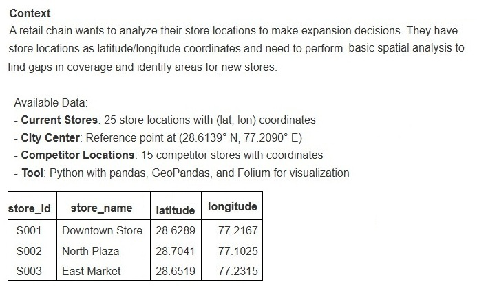
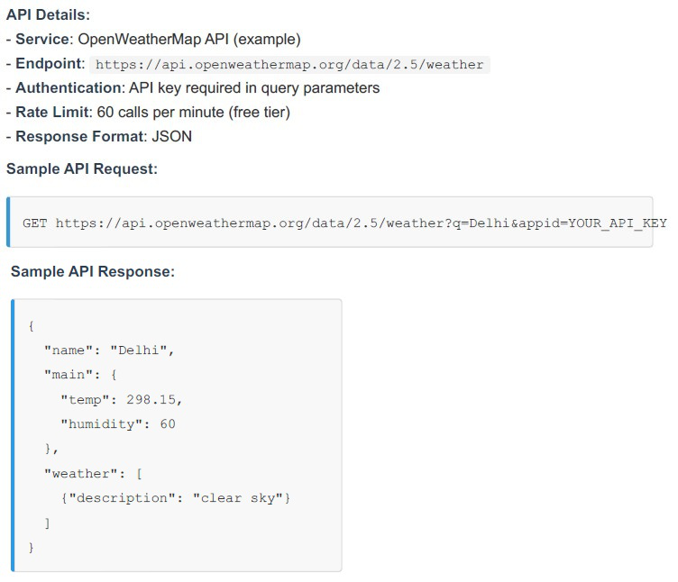
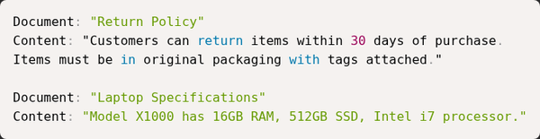

# T3-2025 (Sept 2025) — AN shift · Solved

**37 questions · 40 marks** · one term older: no short answers yet, four big scenario blocks, and some old-syllabus topics to recognize and skip.

> ⚠️ **Read this first:** this paper predates the current syllabus. OpenRefine, geospatial (Folium/GeoPandas) and some legacy tools are **excluded this term** — those questions are marked ⛔ with just the transferable concept. Everything else (RAG, LLM APIs, git, Docker, validation) is current and fully solved.

Every question below is the paper's own text. Answers are the officially marked ones; the reasoning is ours. *(This paper's code was in the text layer, so most questions carry no images — the four scenario data tables are embedded in their blocks.)*

---

## Part 1 · Standalone questions

### Q2 · Markdown's purpose

**🟢 Easy · 1 mark · Topic: File formats**

Which file format is most suitable for lightweight human-readable documentation that converts easily to HTML?

- **A.** DOCX
- **B.** Markdown
- **C.** Binary blob
- **D.** Proprietary word processor format

??? success "Answer — B"
    Markdown.

??? note "Why"
    Markdown is the documentation lingua franca — READMEs, notes, this very site. The
    exam's tell: "lightweight" + "human-readable" + "converts to HTML" is Markdown's
    entire identity. (YAML — from the newer paper — is the *configuration* sibling:
    also whitespace-sensitive, but for data, not prose.)

---

### Q3 · Listing hidden files

**🟢 Easy · 1 mark · Topic: Bash**

Which command lists hidden files in a Unix-like shell?

- **A.** `ls -h`
- **B.** `ls -a`
- **C.** `show -a`
- **D.** `dir /ah`

??? success "Answer — B"
    `ls -a` — shows all entries, including dotfiles.

??? note "Why"
    Files starting with `.` are hidden by default; `-a` (all) reveals them. The trap
    is `-h`: it looks like "hidden" but means **human-readable file sizes** (`ls -lh`
    gives "4.0K" not "4096"). Flag letters are reused across commands — trust usage,
    not mnemonic vibes. (`dir /ah` is Windows CMD — real flag, wrong shell.)

---

### Q4 · HTTP 401

**🟢 Easy · ⭐⭐ · 1 mark · Topic: HTTP status codes · Also asked: T3-2025 FN Q4, ET-2**

In the context of APIs, an HTTP 401 response means:

- **A.** Resource not found
- **B.** Authentication required or failed
- **C.** Server error
- **D.** Rate limit exceeded

??? success "Answer — B"
    Authentication required or failed.

??? note "Why"
    The code family the ET-2 session drilled:

    - **401 Unauthorized** — who are you? Missing/invalid credentials.
    - **403 Forbidden** — I know you; you may not do this. (The professor's example:
      logged in, but viewing someone else's private content.)
    - **404** — no such resource · **429** — too many requests · **5xx** — server's fault.

    🟡 The classic confusion is 401 vs 403: *identity* vs *permission*. One is a locked
    door with no key; the other is a key that doesn't fit this lock.

---

### Q5 · OpenRefine's role · ⛔ Excluded this term

**⛔ Skip · Topic: Data cleaning — the professor said explicitly: no OpenRefine questions**

What is the primary role of OpenRefine in a data workflow?

- **A.** Model training
- **B.** Interactive data cleaning and reconciliation
- **C.** Visual dashboarding
- **D.** Source control

??? success "Answer — B (for reference only)"
    Interactive data cleaning and reconciliation.

??? note "The 30-second version"
    OpenRefine = interactive, GUI-based cleaning of messy data (standardizing names,
    clustering typos). The concept — **normalize → deduplicate** — is current and
    lives in pandas/DuckDB; the tool itself is off-syllabus. If a practice set asks
    its buttons, skip without guilt.

---

### Q6 · Git's benefit

**🟢 Easy · ⭐ · 1 mark · Topic: Git**

Which of the following best describes version control (git) benefit?

- **A.** Automatically cleans data
- **B.** Tracks changes, enables collaboration and rollback
- **C.** Replaces testing
- **D.** Stores only binary assets

??? success "Answer — B"
    Tracks changes, enables collaboration and rollback.

??? note "Why"
    Git's pitch in one line: every change is recorded, attributed, and reversible;
    multiple people work in parallel and merge. It's the safety net *under* your work,
    not a substitute for testing it (C) or a data janitor (A).

---

### Q7 · Catching silent schema drift

**🟡 Medium · 1 mark · Topic: Testing**

When designing small-unit tests for data cleaning functions, which assertion is most valuable to catch silent schema drift?

- **A.** Assert function runs without exception.
- **B.** Assert that output contains expected column names and types.
- **C.** Assert execution time is below threshold.
- **D.** Assert the number of input files.

??? success "Answer — B"
    Assert that output contains expected column names and types.

??? note "Why"
    "Silent schema drift" is the failure where a column renames itself or a date
    becomes a string — the code still *runs*, so A passes while everything downstream
    quietly corrupts. The test that catches it must assert **structure**: column names
    and dtypes.

    Same philosophy as GA0's property-based testing ([T1-2026 AN
    Q10](t1-2026-an.md#q10-property-based-testing-invariant)): test *invariants*, not
    anecdotes.

---

### Q8 · Normalizing messy names

**🟡 Medium · 1 mark · Topic: Data cleaning**

You are extracting customer name data from multiple sources. Some sources return "John Smith" while others return "smith, john". After combining data, you notice duplicate records that differ only in name format. Which approach best handles this situation?

- **A.** Keep both formats since they contain same information.
- **B.** Normalize to first/last name components, standardize case/order, then deduplicate.
- **C.** Delete all records appearing as duplicates arbitrarily.
- **D.** Require users to manually resolve each formatting issue.

??? success "Answer — B"
    Normalize to first/last name components, standardize case/order, then deduplicate.

??? note "Why"
    Deduplication needs a **canonical key**: parse names into components, normalize
    case and order, then "John Smith" and "smith, john" collapse to the same thing
    and dedup becomes trivial. Deduping *before* normalizing (C, A) either keeps
    duplicates or deletes the wrong rows; D doesn't scale past ten records.

    The pattern generalizes: **normalize → key → dedupe** (product names, company
    names, addresses — same recipe, and it's why fuzzy-matching is hard, see Q10).

---

### Q9 · Testing against a flaky external API

**🟡 Medium · ⭐ · 1 mark · Topic: Testing · Also asked: ET-2 (fallbacks)**

Your team uses an external weather API in automated tests. The API sometimes returns temporary errors (500 errors). Which testing approach is most reliable?

- **A.** Test against the live API every time, accepting occasional 500 failures.
- **B.** Record real API responses as offline test files, use files normally, test live periodically.
- **C.** Skip API tests since the provider handles reliability.
- **D.** Mock the API by hardcoding expected weather values for specific cities.

??? success "Answer — B"
    Record real API responses as offline test files, use files normally, test live periodically.

??? note "Why"
    The professional ladder: never let third-party flakiness break *your* CI (A), but
    don't fake the data shape either (D — hardcoded mocks drift from reality and test
    nothing). **Record real responses once, replay them offline** — deterministic
    *and* shaped like the truth — then a small periodic live test catches contract
    changes.

---

### Q10 · Why text matching fails on products

**🔴 Hard · 1 mark · Topic: Data cleaning**

You are combining product data from two suppliers. Supplier A has product names like "Blue T-Shirt Size M" and Supplier B has "tshirt blue m". Why is it difficult to identify these as the same product using simple text matching?

- **A.** The names include extra descriptive words that do not appear in both supplier listings.
- **B.** Effective text comparison requires accounting for variations in word order, abbreviations, and synonyms — a simple word-by-word match is insufficient.
- **C.** Text matching is impossible with product names.
- **D.** The product codes are different so they must be different products.

??? success "Answer — B"
    Effective text comparison requires accounting for variations in word order, abbreviations, and synonyms.

??? note "Why"
    The same normalize→key→dedupe recipe as [Q8](#q8-normalizing-messy-names), with
    the difficulty turned up: real entity matching needs lowercasing, stopword
    removal, synonym/abbreviation handling ("size M" ↔ "m"), maybe embeddings. A is
    *true* but shallow — it names one symptom, not the requirement; the exam wants
    the general rule. C and D are defeatism and key-worship.

---

### Q11 · Idempotent ETL scripts

**🟡 Medium · ⭐ · 1 mark · Topic: ETL · Also asked: T3-2025 FN Q8 (lookback), GA2**

In a bash ETL script that runs on a schedule, what should you do to make sure the job can run repeatedly without causing bad or duplicated results (i.e., to keep it idempotent)?

- **A.** Always write straight into the final output file and overwrite it every time.
- **B.** Write to temp file, atomic move to final, track processed records.
- **C.** Delete all output files at the start of every run.
- **D.** Run the job several times at once so at least one run succeeds.

??? success "Answer — B"
    Write to temp file, atomic move to final, track processed records.

??? note "Why"
    **Idempotent** = running twice has the same effect as running once. The recipe:
    build the output somewhere safe (temp), publish it in one atomic `mv` (a reader
    never sees a half-written file), and track what's been processed so reruns skip
    rather than duplicate.

    A is *nearly* right and fails on the half-written window (a crash mid-overwrite
    corrupts the output); C nukes state every run; D is concurrency arson.

---

### Q12 · Storing currency with conversions

**🟢 Easy · ⭐ · 1 mark · Topic: Data design · Also asked: T3-2025 FN Q12, ET-2**

When converting mixed-currency product feeds for analytics, why store original currency along with the converted value?

- **A.** It is redundant and unnecessary.
- **B.** Enables recalculation if exchange rates change later.
- **C.** It doubles storage but has no benefit.
- **D.** It makes queries faster.

??? success "Answer — B"
    Enables recalculation if exchange rates change later.

??? note "Why"
    A converted number is an *opinion at a point in time*. Store the original amount,
    the currency, and the rate you applied, and you can re-derive everything when
    rates change or a mistake is found — exactly what ET-2's rapid-fire list said:
    "store the original amount plus the specific exchange rate used to enable future
    audits."

---

### Q13 · Upgrading a supported dependency

**🟢 Easy · ⭐ · 1 mark · Topic: Dependency management · Also asked: T1-2026 AN Q14, ET-2**

You maintain a Python script that cleans data. The script uses an external library (e.g., pandas) that your organization will support for the next 2 years. However, a new version of pandas is released with bug fixes. What is the best practice?

- **A.** Immediately upgrade to the latest version of all dependencies.
- **B.** Document current version, test new version separately, upgrade if compatible.
- **C.** Never update any library since updates always break things.
- **D.** Remove the pandas dependency and rewrite your script without it.

??? success "Answer — B"
    Document current version, test new version separately, upgrade if compatible.

??? note "Why"
    The middle path — the exact opposite poles (A: upgrade-everything-now, C:
    never-touch-anything) are both wrong answers in this question family across *all
    four papers*. Professional dependency hygiene: pin versions, test candidates in
    isolation, upgrade on evidence.

---

### Q14 · Fixing AI-generated production bugs

**🟡 Medium · 1 mark · Topic: Production practice**

Your team develops an automated pipeline that classifies customer support tickets into categories. A team member used an AI assistant to write the classification code. The code works correctly in testing but occasionally produces unexpected categories in production. What is the best way to identify and fix this issue?

- **A.** Remove the AI-generated code and rewrite it from scratch.
- **B.** Capture production failures as test cases, fix code, save tests permanently.
- **C.** Accept occasional errors as normal and monitor the error rate.
- **D.** Disable the AI assistant for the entire team.

??? success "Answer — B"
    Capture production failures as test cases, fix code, save tests permanently.

??? note "Why"
    The gold-standard loop: production misbehaviour → capture the offending input as
    a test → fix → the test guards it forever. Note what's *not* blamed: the code's
    authorship (AI or human — A, D) is irrelevant to the engineering; and "monitor
    and accept" (C) is how small bugs become outages. The exam consistently rewards
    **turning failures into fixtures**.

---

### Q15 · Reproducing a dataset months later

**🟡 Medium · ⭐ · 1 mark · Topic: Reproducibility · Also asked: ET-2**

Which provenance strategy most reliably supports reproducing a processed dataset months later when upstream providers may change?

- **A.** Only store final processed CSV.
- **B.** Archive raw inputs, code, dependency versions, artifact hashes in manifest.
- **C.** Rely on upstream to provide the same data again.
- **D.** Keep only commit timestamps.

??? success "Answer — B"
    Archive raw inputs, code, dependency versions, artifact hashes in manifest.

??? note "Why"
    Reproducibility means being able to *re-derive* the output, not just possess it
    (A). Upstream sources drift or vanish (C — the reason you archive raw inputs in
    the first place), and timestamps prove when, not what (D). The manifest with
    artifact hashes also catches silent corruption.

---

### Q16 · Scaling interactive cleaning

**🔴 Hard · 1 mark · Topic: Data cleaning architecture**

For scaling interactive data cleaning to large datasets while retaining reproducibility and human review, the best architecture is:

- **A.** Pure in-memory interactive tool for all rows.
- **B.** Sample-driven transforms as reusable ETL recipes with manual review flags.
- **C.** Manual spreadsheet edits for samples then manual application.
- **D.** Single-run interactive session exported as final CSV.

??? success "Answer — B"
    Sample-driven transforms as reusable ETL recipes with manual review flags.

??? note "Why"
    The tension: interactivity doesn't scale; batch processing doesn't invite human
    judgement. The professional resolution: **explore on a sample, record every
    transformation as code (the recipe), replay on the full dataset, flag edge cases
    for human review.** Reproducible *because* it's code; scalable *because* it's
    batch; human *because* flagged rows get eyes.

    A dies on memory, C and D never become reusable — the exam's longest, most
    detailed option is the architecturally sound one (the pattern the ET-2 session
    called out).

---

### Q17 · Schema validation for JSON providers

**🟡 Medium · ⭐ · 1 mark · Topic: Validation · Also asked: T1-2026 FN Q14 (Pydantic), ET-2**

When designing schema validation for heterogeneous JSON providers, the most robust rule set:

- **A.** Accept any valid JSON, even if it has extra fields.
- **B.** Enforce a schema with required fields, allowed types, and clear errors.
- **C.** Treat all values as text and avoid strict checks.
- **D.** Validate only a few fields to reduce processing time.

??? success "Answer — B"
    Enforce a schema with required fields, allowed types, and clear errors.

??? note "Why"
    ET-2's **fail-fast** strategy, verbatim exam form: audit types and value ranges
    the moment data arrives, reject with an error a human can act on. A and C let bad
    data flow until it corrupts something far from the cause; D validates a sample
    and hopes.

---

## Part 2 · Scenario 1 — store locations on a map (Q18–22) · ⛔ geospatial is out of this term's syllabus

**Scenario 1: Store Location Analysis with Geospatial Data**

{: .tx-full }

*The tools below (Folium, GeoPandas) are off-syllabus — keep only the transferable ideas, marked in each solution.*

### Q18 · The mapping library · ⛔

**1 mark · ⛔ Excluded topic**

When visualizing store locations on an interactive map that stakeholders can explore in a web browser, which Python library is most suitable?

- **A.** Pandas (for data tables)
- **B.** Folium (creates interactive maps with markers and popups)
- **C.** NumPy (for numerical calculations)
- **D.** Requests (for making HTTP calls)

??? success "Answer — B (for reference)"
    Folium.

??? note "Transferable idea"
    Matching the *tool to the audience*: interactive exploration in a browser → a
    web-mapping library, not a data-frame or HTTP library. Tool-selection is the exam
    skill; the tool itself is not.

---

### Q19 · Points within 5 km · ⛔

**1 mark · ⛔ Excluded topic**

You want to find all stores within 5km of the city center. Using GeoPandas, what is the correct general approach?

- **A.** Manually calculate the difference between latitudes and compare to 5.
- **B.** Create a Point for city center, create Points for stores, calculate distances using the appropriate distance method, then filter stores where distance < 5000 meters.
- **C.** Sort stores by latitude and pick the first 5.
- **D.** Use pandas string matching on store names.

??? success "Answer — B (for reference)"
    Create Points, calculate distances, filter by threshold.

??? note "Transferable idea"
    Decomposition: represent entities as objects → compute with a library-provided
    metric → filter with a predicate. The wrong options are shape-mismatched to a
    spatial question.

---

### Q20 · Distances look wrong · ⛔ · ⭐ (concept transfers)

**1 mark · ⛔ Excluded topic — but the concept transfers to current syllabus**

Your analysis shows store locations but distances seem incorrect (e.g., stores 1km apart show as 0.01 units apart). What is the most likely cause?

- **A.** The data is corrupted.
- **B.** Coordinates are in a degree-based CRS; reproject to a metric CRS for correct distances.
- **C.** GeoPandas doesn't work with latitude/longitude.
- **D.** You need to multiply all distances by 100.

??? success "Answer — B (for reference)"
    Coordinates are in a degree-based CRS; reproject to a metric CRS.

??? note "Transferable idea"
    Same lesson as the Haversine questions ([T1-2026 AN
    Q15](t1-2026-an.md#q15-haversine-vs-utm-vs-raw-degrees)): **units matter**.
    Degrees aren't metres (0.01° ≈ 1 km at the equator — the numbers in the question
    are the giveaway). Know this one sentence; skip the rest of the geospatial stack.

---

### Q21 · Communicating the finding

**🟢 Easy · 1 mark · Topic: Data communication — current syllabus**

After finding that 8 stores are within 5km of city center and 17 are farther away, which visualization best communicates this finding?

- **A.** A text file listing store IDs.
- **B.** Interactive map with colored markers and 5km radius.
- **C.** A pie chart of store revenue.
- **D.** A table of raw coordinates.

??? success "Answer — B"
    Interactive map with colored markers and 5km radius.

??? note "Why"
    The right chart is the one where the question's answer is visible at a glance.
    Colors encode the split; the radius circle shows the criterion. A text file and
    raw coordinates hide the pattern; a revenue pie chart answers a question nobody
    asked.

---

### Q22 · The library combo · ⛔

**1 mark · ⛔ Excluded topic**

You have store coordinates in a CSV file. Which Python library combination is most appropriate for performing geographic distance calculations and spatial analysis?

- **A.** Only pandas for reading CSV and calculating distances.
- **B.** Pandas for data handling and GeoPandas for spatial operations (distance calculations, buffers, spatial joins).
- **C.** Only matplotlib for creating maps.
- **D.** Excel for all spatial calculations.

??? success "Answer — B (for reference)"
    Pandas for data handling and GeoPandas for spatial operations.

??? note "Transferable idea"
    The exam loves "which tool for which job" — data handling vs spatial computation
    are separate concerns with separate libraries. Skip the specifics; keep the
    instinct.

---

## Part 3 · Scenario 2 — weather API for event planning (Q23–27) · all current

**Scenario 2: Weather API Integration for Event Planning**

An event management company wants to automate weather data collection for planning outdoor events. They need to fetch current weather and 5-day forecasts from a weather API for multiple cities to help clients make informed decisions.

{: .tx-full }

### Q23 · The HTTP library

**🟢 Easy · 1 mark · Topic: HTTP clients**

To make a request to the weather API, which Python library is most commonly used for HTTP requests?

- **A.** pandas
- **B.** requests (or httpx)
- **C.** flask
- **D.** beautifulsoup

??? success "Answer — B"
    requests (or httpx).

??? note "Why"
    Tool selection: pandas holds data, flask serves it, beautifulsoup parses *HTML* —
    only requests *makes HTTP calls*. The exam's wrong options are always real
    libraries from the wrong layer.

---

### Q24 · Where the API key lives

**🟢 Easy · ⭐⭐ · 1 mark · Topic: Secrets · Also asked: T1-2026 both shifts, ET-1**

The API requires an API key for authentication. Where should you store this API key in your code to follow security best practices?

- **A.** Hard-code it directly in your Python script: `api_key = "abc123xyz"`.
- **B.** Store it in an environment variable (e.g., `os.getenv('WEATHER_API_KEY')`).
- **C.** Write it in a comment in the code.
- **D.** Include it in the GitHub repository README.

??? success "Answer — B"
    Store it in an environment variable.

??? note "Why"
    Third paper, same question, same answer — the `.env` workflow is the single most
    repeated security mark in the set. See [T1-2026 AN Q5](t1-2026-an.md#q5-what-goes-into-gitignore)
    for the full reasoning; A, C, D here are just three flavors of publishing your key.

---

### Q25 · Reading the JSON response

**🟡 Medium · ⭐ · 1 mark · Topic: JSON parsing**

After calling the API, you want to extract the weather description (e.g. "clear sky") from the JSON response. Which is the correct way to access it?

- **A.** `response['weather']['description']`
- **B.** `response_json['weather'][0]['description']`
- **C.** `response['main']['weather']`
- **D.** `response_json['description']['weather']`

??? success "Answer — B"
    `response_json['weather'][0]['description']`

??? note "Why"
    The OpenWeather shape: `{"weather": [{"description": "clear sky", ...}], ...}`.
    Knowing JSON structure means knowing **lists vs objects** — `['weather']` returns
    an array, and chaining `['description']` straight onto an array is a `TypeError`.

    🟡 Also note the distractor style: every option uses the same words in different
    arrangements — reading the actual API shape is the only way through.

---

### Q26 · Respecting the rate limit

**🟢 Easy · ⭐ · 1 mark · Topic: API etiquette**

You need to fetch weather for 10 cities, but the API has a rate limit of 60 calls per minute. How should you structure your code?

- **A.** Make all 10 requests simultaneously as fast as possible.
- **B.** Use a 1–2 sec `sleep()` between requests to avoid rate limits and handle errors.
- **C.** Ignore the rate limit since you're only making 10 calls.
- **D.** Make requests only during off-peak hours.

??? success "Answer — B"
    Use a 1–2 sec `sleep()` between requests to avoid rate limits and handle errors.

??? note "Why"
    10 < 60 *feels* safe (C) — but limits are often per rolling window and shared
    across keys/accounts, and bursts trip protection anyway. The professional pattern:
    **throttle + retry on 429 with backoff.**

    A is the anti-pattern (bursts get you throttled *harder*), D is folk superstition.

---

### Q27 · The 401 diagnosis

**🟢 Easy · ⭐⭐ · 1 mark · Topic: HTTP status codes · Also asked: Q4 above, ET-2**

The API request fails with a 401 error status code. What does this indicate?

- **A.** The API server is down.
- **B.** Unauthorized — likely an invalid or missing API key.
- **C.** The city name is misspelled.
- **D.** Too many requests (rate limit exceeded).

??? success "Answer — B"
    Unauthorized — likely an invalid or missing API key.

??? note "Why"
    The 401 twin of [Q4](#q4-http-401), now inside a scenario. The error-code decision
    tree: key problems (401) vs client request problems (404, misspelled city) vs
    throttling (429) vs server down (5xx). Diagnosis by status code is a free mark
    every time it appears.

---

## Part 4 · Scenario 3 — LLM sentiment analysis (Q28–32) · all current, W3 territory

**Scenario 3: Sentiment Analysis with LLMs**

A product team wants to analyze customer feedback from app reviews to understand user sentiment and identify common issues. Instead of manual review, they use an LLM to automatically classify sentiment and extract key themes from review text.

**Available Data:**

- 500 app reviews (text feedback, 1-5 star ratings)
- LLM API access (e.g., OpenAI GPT, Anthropic Claude)
- Goal: Classify sentiment (positive/negative/neutral) and extract main topics

### Q28 · The HTTP verb for the LLM call

**🟢 Easy · ⭐ · 1 mark · Topic: REST design · Also asked: T1-2026 FN Q25 (as short answer)**

To send a review to an LLM API for sentiment analysis, which type of HTTP request would you typically make?

- **A.** GET request to retrieve sentiment.
- **B.** POST request with the review text in the request body.
- **C.** DELETE request to remove the review.
- **D.** PUT request to update the review.

??? success "Answer — B"
    POST request with the review text in the request body.

??? note "Why"
    The scenario version of the GET-vs-POST short answer: LLM inference *processes*
    submitted data — POST by REST semantics, payload in the body. Here it's one mark;
    in the Jan paper it was 2 marks of writing — same knowledge, escalating format.

---

### Q29 · Designing the prompt

**🟢 Easy · ⭐ · 1 mark · Topic: Prompt engineering**

When designing a prompt for the LLM to classify sentiment, which prompt structure is most effective?

- **A.** Just send the review text with no instructions.
- **B.** Provide clear instructions and specify the desired output format: "Classify the sentiment of this review as positive, negative, or neutral. Review: {review_text}"
- **C.** Send only the word "sentiment".
- **D.** Ask the LLM to write code instead.

??? success "Answer — B"
    Provide clear instructions and specify the desired output format.

??? note "Why"
    Prompt anatomy (course W3 in one mark): **say what to do, define the output
    format, then supply the input**. A gives the model a riddle; C is a password
    attempt; D changes the task. The `{review_text}` placeholder also matters —
    separating instruction from data is the same discipline as system-vs-user prompts.

---

### Q30 · Cost and scale awareness

**🟡 Medium · 1 mark · Topic: LLM production**

You're analyzing 500 reviews using an LLM API. Each API call costs $0.002 and takes 2 seconds. What practical considerations should guide your approach?

- **A.** Send all 500 reviews in a single API call.
- **B.** Process reviews in batches, track costs, handle errors, and cache results.
- **C.** Only analyze 5 reviews to save money.
- **D.** Call the API repeatedly for the same review.

??? success "Answer — B"
    Process reviews in batches, track costs, handle errors, and cache results.

??? note "Why"
    Production LLM thinking in one option: **batch** (rate limits, throughput),
    **track costs** (it's real money), **handle errors** (retries, fallbacks),
    **cache** (identical input → stored output). A exceeds context limits, C abandons
    the task, D is literally burning money.

---

### Q31 · Inconsistent output formats

**🟡 Medium · ⭐ · 1 mark · Topic: LLM production · Also asked: T1-2026 AN Q20 (Structured Outputs)**

The LLM correctly identifies negative reviews but provides inconsistent output formats (sometimes "negative", sometimes "Negative", sometimes "neg"). How do you handle this?

- **A.** Manually review and edit each LLM response to ensure consistent formatting before using it in analysis.
- **B.** Use prompt engineering to enforce exact output format (e.g., "Respond with exactly one word: positive, negative, or neutral in lowercase").
- **C.** Ignore formatting inconsistencies and use LLM responses as they are without additional processing.
- **D.** Switch to a different LLM for each review in hopes of getting consistent output.

??? success "Answer — B"
    Use prompt engineering to enforce exact output format.

??? note "Why"
    LLMs are stochastic; **your prompt must pin the format** if downstream code parses
    it. This is the lighter sibling of Structured Outputs ([T1-2026 AN
    Q20](t1-2026-an.md#q20-what-structured-outputs-guarantees)): prompt enforcement
    (mostly works) vs schema-constrained generation (guaranteed).

    🟢 Chain worth memorizing: *pin the format in the prompt → validate the response →
    escalate to Structured Outputs when it must never break.*

---

### Q32 · Computing the percentage

**🟢 Easy · 1 mark · Topic: pandas**

After classifying all reviews, you want to find what percentage are negative. Which approach correctly calculates this?

- **A.** Manually count negative reviews.
- **B.** Use a DataFrame, count rows with sentiment 'negative', divide by total, multiply by 100.
- **C.** Ask the LLM to calculate the number of negative reviews.
- **D.** Count only positive reviews.

??? success "Answer — B"
    Use a DataFrame, count rows with sentiment 'negative', divide by total, multiply by 100.

??? note "Why"
    Division of labour: the LLM judges each review; **pandas does the math.** Asking
    the LLM to count (C) re-introduces hallucination into a step that should be exact
    — the same principle as our judge: the model returns verdicts, JavaScript sums
    them. `(df['sentiment'] == 'negative').mean() * 100` and you're done.

---

## Part 5 · Scenario 4 — RAG support chatbot (Q33–37) · all current — W4 is a whole RAG week

**Scenario 4: Customer Support Chatbot with RAG**

An e-commerce company is building a customer support chatbot that answers questions about products, policies, and orders. Instead of training a custom model, they use RAG (Retrieval Augmented Generation) to retrieve relevant information from their knowledge base and generate responses.

**System Components:**

- Knowledge Base: 500 product manuals, FAQs, and policy documents
- Vector Database: Stores document embeddings for similarity search
- LLM: Generates responses based on retrieved context
- Chunking Strategy: Break documents into smaller pieces for better retrieval

{: .tx-full }

### Q33 · Why chunk documents

**🟡 Medium · ⭐ · 1 mark · Topic: RAG**

In a RAG system, what is the purpose of breaking documents into smaller chunks before storing them?

- **A.** To save storage space in the database.
- **B.** To match queries with relevant sections, not whole documents, for better accuracy.
- **C.** To make documents easier to read for humans.
- **D.** To reduce the cost of LLM API calls.

??? success "Answer — B"
    To match queries with relevant sections, not whole documents, for better accuracy.

??? note "Why"
    Embeddings compress meaning into one vector — a whole manual averages into mush,
    and even if retrieved, it blows the context window. A chunk (a policy paragraph,
    an FAQ entry) embeds sharply and retrieves precisely: the query "return policy?"
    matches the *returns* chunk, not the 40-page manual that contains it. Accuracy,
    not storage (A) or readability (C).

---

### Q34 · What happens first

**🟡 Medium · ⭐ · 1 mark · Topic: RAG**

When a user asks "What is your return policy?", which step happens FIRST in a RAG system?

- **A.** Generate a response directly using the LLM.
- **B.** Convert the query to an embedding and search similar chunks.
- **C.** Store the user's question in the database for future use.
- **D.** Send an email to customer support.

??? success "Answer — B"
    Convert the query to an embedding and search similar chunks.

??? note "Why"
    The pipeline order: **Retrieve → Augment → Generate.** R = the first letter. A is
    answering without looking anything up (the hallucination risk RAG exists to
    prevent); C and D are workflow fantasies. If you remember one sentence about RAG:
    *the query is embedded and matched against chunk embeddings before the LLM sees
    anything.*

---

### Q35 · Stale answers from old manuals

**🔴 Hard · ⭐ · 1 mark · Topic: RAG**

The chatbot sometimes returns information from outdated product manuals even though newer versions exist. What is the most likely cause of this issue?

- **A.** The LLM relies on outdated training data instead of current documents.
- **B.** Old document chunks remain in the vector database and weren't updated.
- **C.** The document chunking strategy was applied incorrectly or inconsistently.
- **D.** The embedding model is too small to capture document differences accurately.

??? success "Answer — B"
    Old document chunks remain in the vector database and weren't updated.

??? note "Why"
    RAG's Achilles heel: **the vector database is a snapshot.** Ingest v1 of the
    manual, ship v2, forget to remove v1's chunks — now both embed, both retrieve, and
    the LLM can't tell which is authoritative. The fix is operational: re-ingest
    atomically, version or timestamp chunks, expire the old.

    A is the seductive option — "outdated info" *sounds* like training data — but
    RAG's whole point is that answers come from retrieved context, not the model's
    memory. The bug is in the index, not the brain.

---

### Q36 · Choosing the chunk size

**🟡 Medium · ⭐ · 1 mark · Topic: RAG**

When choosing chunk size for splitting documents, which approach generally provides the best balance for a customer support use case?

- **A.** Use very small chunks (1–2 sentences) for highly precise matches.
- **B.** Use medium chunks (1–2 paragraphs, ~200–500 words) for context and focus.
- **C.** Use very large chunks (entire documents) to provide maximum context.
- **D.** Use randomly sized chunks to introduce variety.

??? success "Answer — B"
    Use medium chunks (1–2 paragraphs, ~200–500 words) for context and focus.

??? note "Why"
    The chunk-size trade-off is *the* RAG tuning knob: too small and a retrieved
    fragment lacks the context to answer; too large and embeddings blur plus context
    windows overflow. ~200–500 words is the working middle the course teaches. W4
    dedicates a whole file to chunking strategies — this is examinable at full depth.

---

### Q37 · How the LLM uses retrieved chunks

**🟢 Easy · ⭐ · 1 mark · Topic: RAG**

A customer asks "Can I return my laptop if I opened the box?" The chatbot retrieves two relevant chunks: one about return policy and one about laptop specifications. How does the LLM use these chunks?

- **A.** The LLM ignores the retrieved chunks and answers using its training data.
- **B.** The LLM uses the chunks as context to generate an informed answer.
- **C.** The LLM copies text from the chunks verbatim without changes.
- **D.** The LLM stores the retrieved chunks for future queries.

??? success "Answer — B"
    The LLM uses the chunks as context to generate an informed answer.

??? note "Why"
    "Augmented" in RAG: the prompt carries the retrieved chunks *plus* the question,
    and the LLM composes grounded on them. Not ignored (A — the hallucination path),
    not regurgitated (C — synthesis handles "opened box" which no chunk states
    verbatim). This is the **G** step of Retrieve→Augment→Generate.
