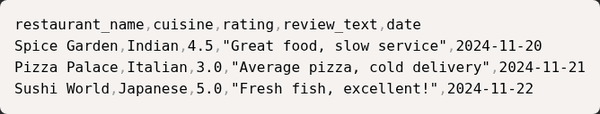
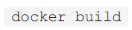
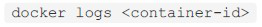
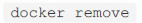
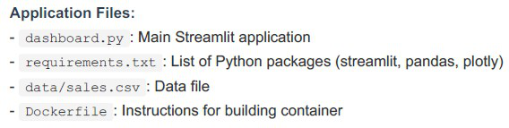
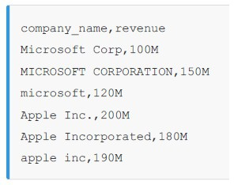

# T3-2025 (Sept 2025) — FN shift · Solved

**37 questions · 40 marks** · the paper the professor solved live in the ET-2 revision session — nearly every question here was discussed on that call.

> ⚠️ **Read this first:** heavier on data-engineering practice questions (ETL, caching, timezones, PII) and workflow scenarios (git, Docker, pandas). The OpenRefine scenario is ⛔ excluded this term. Where a concept is already solved in another paper, this file links instead of repeating.

Every question below is the paper's own text. Answers are the officially marked ones; the reasoning is ours.

---

## Part 1 · Standalone questions

### Q2 · Parquet for large arrays

**🟢 Easy · ⭐⭐ · 1 mark · Topic: Data formats · Also asked: T1-2026 AN Q4, ET-2**

Which data serialization format is most efficient for storing large numeric arrays with minimal overhead?

- **A.** XML
- **B.** Parquet
- **C.** JSON
- **D.** Plain text CSV

??? success "Answer — B"
    Parquet.

??? note "Why"
    The professor's own "odd one out": XML, JSON and CSV are all **text-based**; Parquet
    is the columnar binary outlier. For large numeric arrays it wins on every axis —
    no text-parsing overhead, type-aware compression, and queries that touch only the
    columns they need. Full reasoning: [T1-2026 AN Q4](t1-2026-an.md#q4-why-parquet-beats-csv).

---

### Q3 · git diff

**🟢 Easy · ⭐ · 1 mark · Topic: Git · Also asked: ET-2, course W1**

In Git, which command shows the differences between your working directory and the last commit?

- **A.** `git status`
- **B.** `git diff`
- **C.** `git log`
- **D.** `git show`

??? success "Answer — B"
    `git diff`.

??? note "Why"
    The inspection family from ET-2 (the professor called status+diff your "safety
    goggles before welding" — i.e., before committing):

    - `git status` — *which files* changed/staged/untracked
    - `git diff` — *what lines* changed, working directory vs last commit
    - `git log` — the commit *history* (who, when, message)
    - `git show` — one specific commit's changes in detail

    🟡 **Trap:** `git diff` after `git add` shows *nothing* — by default it compares
    the working directory to the **staging area**. `git diff --staged` shows
    staged-vs-commit.

---

### Q4 · HTTP 429

**🟢 Easy · ⭐⭐ · 1 mark · Topic: HTTP status codes · Also asked: T3-2025 AN Q4, ET-2**

What does HTTP status code 429 indicate?

- **A.** Internal server error
- **B.** Rate limit exceeded
- **C.** Unauthorized access
- **D.** Resource not found

??? success "Answer — B"
    Rate limit exceeded.

??? note "Why"
    Completes the code family: 401/403 identity and permission, 404 absence, **429
    pace**, 5xx server fault. ET-2's note: in modern APIs the client library often
    *handles* 429 for you (retry with exponential backoff).

---

### Q5 · Seaborn · ⛔ out of this term's syllabus

**⛔ Skip · Topic: Visualization — old syllabus**

Which Python library is primarily designed for exploratory data analysis and statistical visualization?

- **A.** NumPy
- **B.** Seaborn
- **C.** Django
- **D.** Flask

??? success "Answer — B (for reference)"
    Seaborn.

??? note "The 30-second version"
    Seaborn = statistical plotting on top of matplotlib (boxplots, distributions,
    heatmaps with one line). It was old-syllabus; the current term's visualization
    lives inside dashboards/scraping contexts. Recognize the name, skip the study.

---

### Q6 · Why environment variables

**🟢 Easy · ⭐⭐ · 1 mark · Topic: Configuration · Also asked: T1-2026 both shifts, T3-2025 AN Q24, ET-1**

What is the main purpose of using environment variables in production systems?

- **A.** To speed up code execution.
- **B.** To store configuration and secrets separately from code.
- **C.** To replace all function parameters.
- **D.** To automatically test applications.

??? success "Answer — B"
    To store configuration and secrets separately from code.

??? note "Why"
    Same concept as the `.env` questions in the Jan shifts — asked here at the
    architecture level (12-Factor style): the *same code* runs in dev/staging/prod by
    reading different environments, and secrets never sit in the repo.

---

### Q7 · Validating external API data

**🟡 Medium · ⭐ · 1 mark · Topic: Validation · Also asked: T3-2025 AN Q17, ET-2**

When validating incoming data from external APIs, which validation strategy prevents downstream pipeline failures most effectively?

- **A.** Check only that the data is not empty.
- **B.** Validate data types, required fields, value ranges — and fail fast with clear error messages.
- **C.** Accept all data and let downstream processes handle errors.
- **D.** Log warnings but process all data regardless.

??? success "Answer — B"
    Validate data types, required fields, value ranges — and fail fast with clear error messages.

??? note "Why"
    ET-2's **fail-fast** principle, verbatim exam form. C and D let bad data travel
    until it corrupts something far from its cause (the most expensive kind of bug),
    and A checks existence when the damage usually lives in types and ranges. This
    concept is asked at least once per paper.

---

### Q8 · Late-arriving orders

**🟡 Medium · ⭐⭐ · 1 mark · Topic: ETL design · Also asked: ET-2 (named twice), GA2**

You are building a daily ETL pipeline that processes customer orders. Orders can arrive late or be updated. Which design pattern ensures you don't miss late-arriving data while avoiding duplicate processing?

- **A.** Process only data from the current day and ignore anything older.
- **B.** Use lookback windows with deduplication based on unique order IDs and update timestamps.
- **C.** Reprocess all historical data every day to ensure completeness.
- **D.** Process data as it arrives without tracking what has been processed.

??? success "Answer — B"
    Use lookback windows with deduplication based on unique order IDs and update timestamps.

??? note "Why"
    The professor's flagship ETL pattern, named in both revision sessions: a **lookback
    window** (process the last ~3 days, not just today) catches late arrivals, while
    **deduplication on (order_id, updated_at)** means re-seeing a row is harmless —
    the newest version wins.

    C is the trap the professor called "a failure of design": full reprocessing burns
    compute, takes hours, and locks the database. A loses the late rows (the stated
    symptom); D has no memory at all.

---

### Q9 · Caching an hourly-updated dashboard

**🟡 Medium · ⭐⭐ · 1 mark · Topic: Caching · Also asked: T1-2026 both shifts, ET-1 + ET-2**

Your analytics dashboard queries a large dataset that updates hourly but is queried every few seconds by users. Which caching strategy improves performance while maintaining reasonable freshness?

- **A.** Never cache — always query the live dataset directly.
- **B.** Cache results with a TTL matching the update frequency, and invalidate on updates.
- **C.** Cache results permanently without refreshing.
- **D.** Disable the dashboard whenever the dataset is updated.

??? success "Answer — B"
    Cache results with a TTL matching the update frequency, and invalidate on updates.

??? note "Why"
    The workload is asymmetric: 1 update/hour vs ~3600 reads/hour — perfect caching
    conditions. A **5-minute TTL** means the database is hit once per interval instead
    of every few seconds (the professor's exact arithmetic), and freshness loss is
    bounded by the TTL itself. Same family as `max-age=3600`
    ([T1-2026 AN Q19](t1-2026-an.md#q19-what-max-age3600-does)).

---

### Q10 · Joining across timezones

**🔴 Hard · ⭐ · 1 mark · Topic: Data joining · Also asked: ET-2**

When joining datasets from different time zones, you discover that some timestamps lack timezone information. What is the safest approach?

- **A.** Assume all missing timestamps are in UTC for simplicity.
- **B.** Infer timezone from metadata or location, document assumptions, and flag inferred values.
- **C.** Reject any records without explicit timezone information.
- **D.** *(distractor: a pandas parsing error claim)*

??? success "Answer — B"
    Infer timezone from metadata or location, document assumptions, and flag inferred values.

??? note "Why"
    Silent assumptions are how **silent data corruption** happens: a "UTC" guess
    that's actually local time shifts every join by hours. The professional recipe:
    infer from evidence, **document** the assumption, **flag** inferred rows. A is
    the tempting shortcut (the classic mistake the question exists to catch); C
    throws away real data over metadata.

---

### Q11 · Versioning transformation logic

**🟢 Easy · ⭐ · 1 mark · Topic: Reproducibility · Also asked: ET-2**

You maintain a pipeline that transforms raw logs into analytics tables. The transformation logic changes frequently. How should you version and test these transformations?

- **A.** Keep all logic in a single script and update it directly.
- **B.** Version transformations with git, write unit tests, test on sample data before production.
- **C.** Manually document changes in a shared document.
- **D.** Avoid making changes to prevent breaking existing processes.

??? success "Answer — B"
    Version transformations with git, write unit tests, test on sample data before production.

??? note "Why"
    ET-2's rapid-fire rule: **version the transformation logic** — it changes more
    often than the data schema, so it needs the full software hygiene stack. A is
    living dangerously; C documents *that* changes happened, not *what*; D freezes
    fear into architecture. The pipeline is a program; treat it like one.

---

### Q12 · Storing the exchange rate

**🟢 Easy · ⭐ · 1 mark · Topic: Data design · Also asked: T3-2025 AN Q12, ET-2**

When aggregating financial transaction data across multiple currencies, why is it important to store both the original currency amount and the exchange rate used for conversion?

- **A.** It's unnecessary; storing only the converted amount is sufficient.
- **B.** Enables auditing, recalculation with updated rates, and transparency.
- **C.** It wastes storage with no practical benefit.
- **D.** Regulatory requirements mandate it for all data types.

??? success "Answer — B"
    Enables auditing, recalculation with updated rates, and transparency.

??? note "Why"
    The AN twin ([T3-2025 AN Q12](t3-2025-an.md#q12-storing-currency-with-conversions))
    compressed: original + rate = auditable and recomputable. D is the interesting
    distractor — *some* finance regulations do mandate it, but "all data types" makes
    it false; the engineering reason (B) is the general one.

---

### Q13 · Fixing biased recommendations

**🟡 Medium · 1 mark · Topic: ML practice · Also asked: ET-2 (rapid-fire)**

Your team builds a recommendation system that suggests products to users. After deployment, you notice that recommendations for certain user segments are significantly worse than others. What is the best systematic approach to diagnose and fix this?

- **A.** Retrain the model with more data and hope it improves.
- **B.** Analyze performance by segment, identify biases in training data, add segment-specific tests, and validate fixes.
- **C.** Disable recommendations for poorly performing segments.
- **D.** Manually override recommendations for affected users.

??? success "Answer — B"
    Analyze performance by segment, identify biases in training data, add segment-specific tests, and validate fixes.

??? note "Why"
    An *aggregate* score hides *segment* failures, so the first move is **slicing the
    metrics**. Then the cause is usually training data (a segment underrepresented),
    and the fix earns trust only with segment-level tests. A is "have you tried
    throwing more data at it" (hope isn't a method); C and D hide the problem from the
    affected users.

---

### Q14 · Vulnerable dependency with breaking changes

**🟡 Medium · ⭐ · 1 mark · Topic: Dependency management · Also asked: T1-2026 AN Q14, ET-2**

Your data pipeline uses a third-party library that has known security vulnerabilities in older versions. The latest version includes breaking API changes. What should you do?

- **A.** Stay on the older vulnerable version to avoid breaking existing code.
- **B.** Assess vulnerability severity, test the new version in staging, and plan migration or patches.
- **C.** Update to the latest version immediately without any testing.
- **D.** Replace the library entirely with custom code regardless of complexity.

??? success "Answer — B"
    Assess vulnerability severity, test the new version in staging, and plan migration or patches.

??? note "Why"
    The dependency question at its hardest: **two risks in tension** — the
    vulnerability you're exposed to vs the breakage the upgrade might cause. The
    professional move measures both: how severe is the CVE (is it even reachable in
    your usage?), and does the new version pass *your* tests in staging?

    A ignores a known security hole; C is the "immediately upgrade" pole every paper
    marks wrong; D rewrites a library because updating it seemed scary.

---

### Q15 · Reproducible notebooks

**🟡 Medium · ⭐ · 1 mark · Topic: Reproducibility · Also asked: T3-2025 AN Q15, ET-2**

For ensuring long-term reproducibility of data analysis notebooks that depend on external data sources and multiple libraries, which approach is most comprehensive?

- **A.** Save only the final notebook with outputs.
- **B.** Use containers, pin dependencies, archive input data, version-control notebooks, and document the environment.
- **C.** Share notebooks via email with verbal instructions.
- **D.** Rely on cloud platforms to maintain compatibility.

??? success "Answer — B"
    Use containers, pin dependencies, archive input data, version-control notebooks, and document the environment.

??? note "Why"
    The comprehensive reproducibility stack — and note it's the **longest, most
    detailed option**, the pattern the ET-2 session told you to notice. Containers
    (same runtime), pinned deps (same libraries), archived inputs (same data — because
    upstreams change), version control (same code), documentation (the map).

---

### Q16 · Data lineage metadata

**🔴 Hard · 1 mark · Topic: Data engineering**

When implementing data lineage tracking for a complex pipeline with multiple data sources, transformations, and outputs, which metadata is most critical to capture?

- **A.** Capture only the final output location of the pipeline.
- **B.** Capture source IDs, transformation versions, timestamps, data quality metrics, and dependencies.
- **C.** Capture only the names of users who executed the pipeline.
- **D.** Capture only storage costs and query performance metrics.

??? success "Answer — B"
    Capture source IDs, transformation versions, timestamps, data quality metrics, and dependencies.

??? note "Why"
    **Lineage** answers "where did this number come from?" — and for a number in a
    dashboard, the answer crosses sources, transformation versions, and time. The
    metadata list in B *is* the lineage. A, C, D each capture one slice and call it
    the picture — the "only" in each option is the tell.

---

### Q17 · PII data minimization

**🟡 Medium · ⭐ · 1 mark · Topic: Privacy · Also asked: ET-2 (rapid-fire)**

Your pipeline processes personally identifiable information (PII). A privacy audit requires you to implement data minimization. Which strategy best balances utility and privacy?

- **A.** Encrypt all data and continue processing it without changes.
- **B.** Keep only necessary fields, anonymize or aggregate data, enforce access controls, and document retention.
- **C.** Delete all PII immediately without considering business requirements.
- **D.** Move PII to a separate database while keeping the same access patterns.

??? success "Answer — B"
    Keep only necessary fields, anonymize or aggregate data, enforce access controls, and document retention.

??? note "Why"
    The four pillars of **data minimization**: field-level necessity, anonymization/
    aggregation, access control, and documented retention. It's a *balance* — the
    business still functions. A is the classic pseudo-compliance: encryption protects
    at rest, but the pipeline then *decrypts and processes* everything anyway. C is
    privacy at the cost of the product; D relocates the problem.

---

## Part 2 · Scenario 1 — restaurant reviews with pandas (Q18–22) · all current — the professor's ET-2 case study

**Scenario 1: Restaurant Review Data Analysis**

A food delivery platform wants to analyze restaurant reviews to identify trending cuisines and customer satisfaction patterns. They have review data in CSV format with ratings, text comments, and timestamps.

{: .tx-full }

### Q18 · Missing review text

**🟢 Easy · ⭐ · 1 mark · Topic: pandas**

The dataset has some missing values in the review_text column (some customers left ratings but no comment). Before analyzing review text for common words, what should you do?

- **A.** Ignore missing values and let pandas handle them automatically.
- **B.** Remove rows with missing review text using `df.dropna(subset=['review_text'])`.
- **C.** Replace all missing review text entries with the word "missing".
- **D.** Delete the entire review_text column from the dataset.

??? success "Answer — B"
    Remove rows with missing review text using `df.dropna(subset=['review_text'])`.

??? note "Why"
    The professor's **NLP trap** from ET-2: for *text* analysis, rows with no text are
    pure noise — they'd pollute word counts as `NaN` (A) or, catastrophically, make
    "missing" the most common word in your corpus (C). `dropna(subset=[...])` targets
    exactly the column you need.

    🟡 Note the *scope*: you're dropping rows only for the text analysis — their
    **ratings** still count elsewhere. Cleaning is per-question, not global.

---

### Q19 · Words in negative reviews

**🟢 Easy · 1 mark · Topic: pandas**

To identify the most common words in negative reviews (rating < 3.0), which approach correctly combines filtering and text analysis?

- **A.** Count all words in all reviews regardless of rating.
- **B.** Filter for low ratings, then extract and count words from the review_text column.
- **C.** Sort reviews by rating and manually read the bottom ones.
- **D.** Use only the rating numbers without looking at text.

??? success "Answer — B"
    Filter for low ratings, then extract and count words from the review_text column.

??? note "Why"
    Pandas thinking in miniature: `df[df['rating'] < 3]['review_text']` → split/count
    words. The filter and the analysis are independent operations chained. A answers
    a different question, C doesn't scale, D ignores the text entirely.

---

### Q20 · Sharing results with non-technical stakeholders

**🟢 Easy · ⭐ · 1 mark · Topic: Data communication · Also asked: ET-2**

After completing the analysis, which file format is most appropriate for sharing summary results (e.g., average rating by cuisine) with non-technical stakeholders?

- **A.** Python pickle file (`.pkl`)
- **B.** CSV file that can be opened in Excel
- **C.** JSON with nested structures
- **D.** Binary database file

??? success "Answer — B"
    CSV file that can be opened in Excel.

??? note "Why"
    ET-2's stakeholder rule: **know your audience's tools.** A non-technical manager
    lives in Excel/Sheets — CSV is the lowest common denominator that just works.
    Pickle requires Python (and is a security risk to open!), JSON needs a programmer,
    a database file needs a database. The professor's phrasing: "why a CSV is the best
    format for a non-technical manager — portability and ease of use."

---

### Q21 · The library for tabular CSV

**🟢 Easy · 1 mark · Topic: pandas**

Which Python library is most commonly used for loading and analyzing tabular CSV data like this restaurant reviews dataset?

- **A.** requests
- **B.** pandas
- **C.** BeautifulSoup
- **D.** Flask

??? success "Answer — B"
    pandas.

??? note "Why"
    Tool selection, one mark: requests fetches, BeautifulSoup parses HTML, Flask
    serves — pandas holds and shapes tables. (Course W6 pairs it with DuckDB for
    larger-than-memory work.)

---

### Q22 · Average rating per cuisine

**🟢 Easy · ⭐⭐ · 1 mark · Topic: pandas · Also asked: ET-2 (taught verbatim), GA6**

To find the average rating for each cuisine type (Indian, Italian, Japanese), which pandas operation is most appropriate?

- **A.** `df.sort_values('cuisine')`
- **B.** `df.groupby('cuisine')['rating'].mean()`
- **C.** `df.filter('cuisine')`
- **D.** `df.merge('cuisine', 'rating')`

??? success "Answer — B"
    `df.groupby('cuisine')['rating'].mean()`

??? note "Why"
    **groupby = split–apply–combine**: split rows by cuisine, apply `mean()` to each
    group's ratings, combine into one table. The professor taught this exact line in
    ET-2. The wrong options are real pandas verbs pointed at the wrong job — sort
    arranges but doesn't aggregate, `filter` selects *rows* (and takes callables, not
    column names), merge joins *dataframes*. One line, three sources — **free marks**.

---

## Part 3 · Scenario 2 — the team Git workflow (Q23–27) · all current, course W1

**Scenario 2: Automated Git Workflow for Team Project**

A data science team uses Git for version control on a shared project. Multiple team members work on different features simultaneously. They follow a workflow where everyone works on separate branches and merges into the main branch through pull requests.

**Current Setup:**

- main branch: Production-ready code
- dev branch: Development/testing code
- Feature branches: Individual work (e.g., feature-data-cleaning, feature-visualization)

### Q23 · The save-and-upload sequence

**🟢 Easy · ⭐ · 1 mark · Topic: Git**

After making changes to your code, what is the correct sequence to save your work and upload it to GitHub?

- **A.** `git push` → `git add` → `git commit`
- **B.** `git commit` → `git add` → `git push`
- **C.** `git add` → `git commit` → `git push`
- **D.** `git merge` → `git push`

??? success "Answer — C"
    `git add` → `git commit` → `git push` — always in that order.

??? note "Why"
    The pipeline is one-directional: working directory --`add`--> staging --`commit`-->
    local history --`push`--> remote. Pushing *before* committing (A) sends nothing;
    committing *before* staging (B) commits an empty snapshot; merge isn't part of
    saving at all (D). If you can narrate the diagram, no option can confuse you.

---

### Q24 · The merge conflict

**🟡 Medium · ⭐ · 1 mark · Topic: Git**

Two team members both modify the same line in analysis.py on different branches. When the second person tries to merge their branch, what will happen?

- **A.** Git automatically keeps the newer change.
- **B.** Git creates a merge conflict that must be resolved manually by choosing which change to keep.
- **C.** Git deletes both changes.
- **D.** Git randomly picks one change.

??? success "Answer — B"
    Git creates a merge conflict that must be resolved manually.

??? note "Why"
    Git tracks *what* changed, not *who was right*: two edits to the same lines of
    history is a genuine ambiguity no algorithm should resolve silently. Git pauses
    the merge, marks the file (`<<<<<<<` / `=======` / `>>>>>>>`), and the second
    merger edits the file to the intended truth, then commits the resolution. A, C, D
    all describe silent decisions — exactly what version control exists to prevent.

---

### Q25 · Getting the latest main

**🟢 Easy · ⭐ · 1 mark · Topic: Git**

Before pushing your changes, you want to make sure your branch has the latest updates from the main branch. Which command downloads and integrates those updates?

- **A.** `git commit main`
- **B.** `git pull origin main` (while on your feature branch)
- **C.** `git delete main`
- **D.** `git init main`

??? success "Answer — B"
    `git pull origin main` (while on your feature branch).

??? note "Why"
    `git pull origin main` fetches the remote main and merges it into what you're on —
    update-before-push, the habit that prevents most conflicts. (Cousins: `git fetch`
    downloads without merging; `git pull --rebase` replays your commits on top for a
    linear history.)

---

### Q26 · Why pull requests exist

**🟢 Easy · ⭐ · 1 mark · Topic: Git**

What is the main purpose of creating a pull request (PR) instead of directly merging your branch into main?

- **A.** Pull requests are faster than merging.
- **B.** Pull requests allow team members to review your code, suggest changes, and approve before merging.
- **C.** Pull requests automatically fix bugs.
- **D.** Pull requests are only for documentation.

??? success "Answer — B"
    Pull requests allow team members to review your code, suggest changes, and approve before merging.

??? note "Why"
    A PR is a **conversation about a merge**: reviewers see the diff, comment, request
    changes, and the branch merges only when approved. It's how a team shares
    responsibility for what enters main — the story's whole workflow (feature branch →
    PR → review → merge) exists to make "production-ready" mean something.

---

### Q27 · Running with the port published

**🟢 Easy · ⭐⭐ · 1 mark · Topic: Docker · Also asked: T1-2026 AN Q28, ET-2**

After building the Docker image, which command correctly runs the container and makes the dashboard accessible on port 8501?

- **A.** `docker build -t dashboard .`
- **B.** `docker run -p 8501:8501 dashboard`
- **C.** `docker push dashboard`
- **D.** None of these

??? success "Answer — B"
    `docker run -p 8501:8501 dashboard`.

??? note "Why"
    The `-p host:container` flag is the bridge that makes the container's port visible
    on your machine. A builds (no run), C uploads to a registry (nothing runs
    locally). Streamlit's default port is 8501 — worth knowing since both papers use
    it.

---

### Q28 · Why Docker for deployment

**🟢 Easy · ⭐⭐ · 1 mark · Topic: Docker · Also asked: T1-2026 FN Q5, ET-1**

What is the main advantage of using Docker to deploy the dashboard?

- **A.** Docker makes the code run faster.
- **B.** Docker packages the application with all dependencies in a container, ensuring it runs consistently across different machines.
- **C.** Docker automatically writes code for you.
- **D.** Docker provides free hosting.

??? success "Answer — B"
    Docker packages the application with all dependencies in a container, ensuring it runs consistently across different machines.

??? note "Why"
    Docker's elevator pitch, asked in some form in **all four papers**: OS + runtime +
    libraries + code, sealed into one artifact. "Works on my machine" stops being an
    excuse. Docker does not speed code up (A), write it (C), or host it for free (D).

---

### Q29 · Reading the crash logs

**🟢 Easy · ⭐ · 1 mark · Topic: Docker · Also asked: ET-2**

The dashboard application crashes when deployed. Which Docker command shows the application's error messages and logs?

- **A.** 
- **B.** 
- **C.** 
- **D.** 

??? success "Answer — C"
     — `docker logs <container>`. *(the paper's options are command images; the green-marked one is C)*

??? note "Why"
    A container that exits still has its stdout/stderr captured: `docker logs
    <container>` replays them — the first stop for any container crash. Its cousins:
    `docker ps` (what's running), `docker exec -it <container> bash` (step inside a
    *live* container). When something dies in a box, the box keeps the diary.

---

### Q30 · The Dockerfile install line

**🟢 Easy · ⭐⭐ · 1 mark · Topic: Docker · Also asked: T1-2026 FN Q11, ET-1 + ET-2**

In the Dockerfile, which command specifies which Python packages should be installed in the container?

- **A.** `RUN pip install -r requirements.txt`
- **B.** `COPY dashboard.py`
- **C.** `EXPOSE 8501`
- **D.** `FROM python:3.11`

??? success "Answer — A"
    `RUN pip install -r requirements.txt`.

??? note "Why"
    The Dockerfile verbs: `FROM` names the base image, `COPY` brings files in, `RUN`
    **executes** commands during the build, `EXPOSE` documents a port. Only RUN
    installs anything — the third paper carrying this answer.

---

### Q31 · What EXPOSE does

**🟢 Easy · ⭐⭐ · 1 mark · Topic: Docker · Also asked: T1-2026 AN Q28, ET-2**

The Dockerfile includes the line `EXPOSE 8501`. What does this do?

- **A.** Automatically makes the application accessible to anyone on the internet.
- **B.** Documents the listen port; you must still publish it using `-p 8501:8501`.
- **C.** Closes port 8501 for security.
- **D.** Changes the application code to use port 8501.

??? success "Answer — B"
    Documents the listen port; you must still publish it using `-p 8501:8501`.

??? note "Why"
    The professor's one-liner from ET-2: **EXPOSE is a label; `-p` is the bridge.**
    Third appearance across the papers. If a container runs but `localhost:8501`
    refuses to connect, you forgot `-p` — the single most Docker question in the
    corpus.

---

## Part 4 · Scenario 3 — deploying the Streamlit dashboard with Docker (Q28–32, continuing)

**Scenario 3: Deploying a Data Dashboard with Docker**

A team built a Python dashboard using Streamlit that visualizes sales data. They want to deploy it so anyone can access it via a web browser. They decide to use Docker to package the application with all its dependencies.

{: .tx-full }

*Q28–Q31 above complete this scenario's questions.*

---

## Part 5 · Scenario 4 — OpenRefine data cleaning (Q33–37) · ⛔ excluded this term

**Scenario 4: OpenRefine for Data Cleaning**

A researcher has a dataset of company names from different sources. The same companies are spelled differently across sources, making analysis difficult.

{: .tx-full }

*The professor explicitly excluded OpenRefine from this term's syllabus — skip these five questions in practice. The transferable concepts (already solved elsewhere):*

- **Q33 — standardize case then title-case** → the normalize step of [normalize → key → dedupe](t3-2025-an.md#q8-normalizing-messy-names) (T3-2025 AN Q8)
- **Q34 — combine duplicate companies by grouping + summing revenue** → groupby aggregation, the [restaurant-reviews pattern](#q22-average-rating-per-cuisine) wearing a cleaning costume
- **Q35 — exportable/replayable operations** → reproducibility: operations as replayable code, same idea as [reusable ETL recipes](t3-2025-an.md#q16-scaling-interactive-cleaning) (T3-2025 AN Q16)
- **Q36 — the data quality issue** → inconsistent naming/capitalization for the same entity (recognition only)
- **Q37 — grouping similar text values to merge** → text clustering (recognition only)

**Bottom line:** if a practice paper shows OpenRefine, you now know exactly which concept each question secretly tests — and that the tool itself won't be on your exam.
